# 1 ATVC概述
ATVC将Vector算子开发流程中的可定制化模块抽象出了Host层和Kernel层，它们的基本概念如下：<br>
- Host层：在CPU Host侧执行，提供Tiling计算&策略分派的API，它根据实际数据场景帮助用户计算出较优的数据搬运等运行态参数。
- Kernel层：它是利用Ascend C API搭建出的一系列Vector算子模板类，屏蔽了算子开发中用户无需感知的数据搬入搬出以及资源申请等固定模块，并将核心计算模块开放给用户定义。

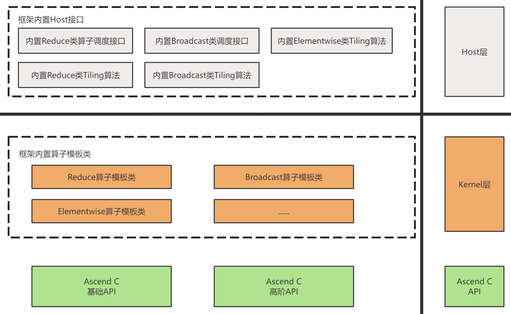<br>

基于如上分层结构，ATVC中一个核函数的实现与调用的关系如下图所示（ATVC框架提供的模板及接口用黄色表示；支持开发自定义的模块用蓝色表示）：
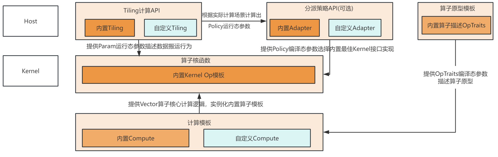<br>

<br> 

## ATVC支持的模板和数据类型  

| 算子模板        | 数据类型       | 规格限制说明 |
| -------------------- | ---------------- | ---------- |
| Elementwise | int32_t、float               |  |
| Reduce | int32_t、float               | 当前只支持4维以内的reduce计算 |
| Broadcast | int32_t、float            | 当前只支持2维以内对齐场景的计算 |
| Pool | int32_t、float            | 只支持2维以内场景的计算 |


## ATVC当前的模板提供的接口/类列表  

+ ElementWise模板
    | API层级 | API类或接口名称 |
    |------|------|
    |Host|CalcEleWiseTiling |
    |Kernel|EleWiseOpTemplate|

+ Reduce模板API
    | API层级 | API类或接口名称 |
    |------|------|
    |Host|CalcReduceTiling |
    |Kernel|ReduceOpTemplate|

+ Broadcast模板API
    | API层级 | API类或接口名称 |
    |------|------|
    |Host|CalcBroadcastTiling |
    |Kernel|BroadcastOpTemplate |
+ Pool模板API
    | API层级 | API类或接口名称 |
    |------|------|
    |Host|CalcPoolTiling |
    |Kernel|PoolOpTemplate |

## 算子类型说明
- Elementwise类算子  
Elementwise类算子通常是指对张量进行元素级别的操作的函数或方法，包括但不限于加、减、乘、除及指数、对数、三角函数等数学函数。这类算子的特点是会逐元素进行计算操作，而不会改变输入数据的形状。常见的Elementwise算子有Add、Sub、Exp、Log、Sin、Sqrt等。

- Reduce类算子  
Reduce类算子通常是指对张量中的元素进行归约操作的算子，通常用来求和、求平均值等操作，可指定某几个维度进行归约计算，也可以将所有元素归约计算为一个标量。常见的Reduce类算子有ReduceSum（求和）、ReduceMean（求平均值）、ReduceProdcut（累乘）、ReduceMax（求最大值）、ReduceMin（求最小值）、ReduceAny（or操作）、ReduceAll（and操作）。

- Broadcast类算子  
Broadcast算子用于在张量形状不一致时实现张量间的逐元素运算。
设张量A的Shape为(1, 5)，张量B的Shape为(3, 5)。为完成C = A + B，首先需依据广播规则将A由(1, 5)扩展至(3, 5)。该过程通过在长度为1的维度上复制数据，使两个张量的形状对齐，从而支持逐元素相加运算。

- Pool类算子  
Pool类算子常用于神经网络的池化层，可以达到降采样、特征提取等功能。  
举例说明，若输入数据Shape是(4, 4)，池化窗口为(2, 2)，输入数据为：  
[[1, 2, 3, 4],
 [5, 6, 7, 8],
 [9, 10, 11, 12],
 [13, 14, 15, 16]]  
 若步幅为2，不使用填充，最大池化的操作结果如下：  
[[6, 8],
 [14, 16]]


# 2 公共数据结构
我们将对ATVC核函数定义以及调用涉及的三个公共数据概念：算子原型的编译态参数`OpTraits`、Tiling计算的运行态参数`Param`、 模板策略的编译态参数`Policy`分别进行介绍。

## 2.1 OpTraits
ATVC框架参考C++模板元编程的`type_list`实现，推出了`ATVC::OpInputs`、`ATVC::OpOutputs`、`ATVC::OpTemps`的模板结构体分别用于描述算子的计算输入、计算输出、计算过程的临时资源，支持C++基础类型作为不定长模板参数传入。它们三者组成了整个ATVC框架编译态参数`OpTraits`。`ATVC::OpTraits`的完整数据定义如下：<br>
```cpp
// atvc_opdef.h
namespace ATVC {
// 定义三种模板结构体类型
enum class ParamType {
    INPUT, // 输入
    OUTPUT, // 输出
    TEMP, // 临时计算资源
};

template <ParamType paramType_, typename ... Ts>
struct ParamTypes{
    using types = ATVC::TypeList<Ts...>;
    static constexpr ParamType usage = paramType_;
};

template <typename ... Ts>
using OpInputs = ParamTypes<ParamType::INPUT, Ts...>;

template <typename ... Ts>
using OpOutputs = ParamTypes<ParamType::OUTPUT, Ts...>;

template <typename ... Ts>
using OpTemps = ParamTypes<ParamType::TEMP, Ts...>;

// OpTraits的结构体定义，TempTypeList默认为空
template <typename InTypeList, typename OutTypeList, typename TempTypeList=ATVC::OpTemps<>>
struct OpTraits {
    using In = InTypeList;
    using Out = OutTypeList;
    using Temp = TempTypeList;
};
}
```
<br>

在ATVC框架中，一个实现两个浮点数相加运算的Add算子的`ATVC::OpTraits`描述代码样例如下：
```c++
// Add算子计算原型 ： c = a + b
using AddInputs = ATVC::OpInputs<float, float>;                      // Add对应两个输入，类型均为float
using AddOutputs = ATVC::OpOutputs<float>;                           // Add有一个输出，类型为float
using AddTemps = ATVC::OpTemps<>;                                    // 运算过程中不需要临时buffer保存中间结果,模板参数为空
using AddOpTraits = ATVC::OpTraits<AddInputs, AddOutputs, AddTemps>; // Add算子的计算原型描述
```


## 2.2 Param
ATVC框架提供了`ATVC::EleWiseParam`、`ATVC::ReduceParam`、`ATVC::BroadcastParam` 三个结构体来描述算子内部调度的Tiling数据和其他资源变量。Param 作为Host侧Tiling API的输出，它将传入ATVC框架的Kernel层算子模板，并在运行时指导算子内部模块完成数据的循环搬运与调度计算。<br>

以下为ElementWise类算子的`ATVC::EleWiseParam`参与计算的伪代码，详细使用流程请参考本文档的 [3.1.2.3 Policy与Param的计算与传递](#3123-policy与param的计算与传递)：
```cpp
// 声明运行态参数param
ATVC::ElewiseParam param;
// totalCnt描述EleWise单输入的元素个数
int32_t totalCnt = 1024; 
// OpTraits为算子描述原型，CalcEleWiseTiling根据实际元素计算Tiling策略并将结果写入param
ATVC::Host::CalcEleWiseTiling<OpTraits>(totalCnt, param);
// 将param拷贝至device空间上
uint8_t* paramDevice;
aclrtMemcpy(paramDevice, sizeof(param), reinterpret_cast<uint8_t*>(&param), sizeof(param), ACL_MEMCPY_HOST_TO_DEVICE);

// EleWiseKernel为开发自定义的Kernel入口，传入paramDevice
EleWiseKernel<<<param.tilingData.blockNum, nullptr, stream>>>(x, y, z, paramDevice);
```

## 2.3 Policy
编译态参数`Policy`（`ATVC::ReducePolicy`、`ATVC::BroadcastPolicy`）是ATVC框架里Kernel层对部分算子模板的拓展描述，它对应算子模板类在不同场景的实例化实现。它由Tiling API计算出，并在策略分派API（`ATVC::Host::ReduceAdapter`）里将运行态的Policy结果转化为模板参数并调用该场景下的最佳模板实现来完成高效的数据计算。<br>

以下为Reduce算子开发场景中`ATVC::ReducePolicy`参与计算的伪代码，详细过程请参考[3.2.2.3 Policy与Param的计算与传递](#3223-policy与param的计算与传递)：
```cpp
// 声明policy和param变量
ATVC::ReducePolicy policy = {-1, -1, -1};
ATVC::ReduceParam param;
// OpTraits为算子描述原型，CalcReduceTiling API负责计算出该场景最佳数据搬运策略param以及最佳模板算子实现对应的policy
ATVC::Host::CalcReduceTiling<OpTraits>(..., &policy, &param);

// ReduceAdapter根据policy具体值将动态参数转为静态模板参数，并传入核函数
if (policy.patternId == 1 && policy.loopCnt == 2 && policy.loopInnerCnt == 3) {
    constexpr ATVC::ReducePolicy selectedPolicy = {1, 2, 3};
    ReduceKernel<OpTraits, selectedPolicy><<<...>>>(...);
}

// 自定义的ReduceKernel核函数内部调用了ReduceOpTemplate算子模板类, 该模板类内部实现了Policy对应的各种计算场景
template <class OpTraits, const ATVC::ReducePolicy& Policy>
__global__ __aicore__ ReduceKernel(GM_ADDR x, GM_ADDR y, ATVC::ReduceParam param) {
    auto op = ATVC::Kernel::ReduceOpTemplate<OpTraits, Policy, ...>(); // 实例化算子Kernel模板, Policy作为模板参数传入
    op.Run(x, y, &param); // param作为运行态参数传入
}
```


# 3 利用ATVC完成算子开发
## 3.1 Elementwise算子开发
### 3.1.1 Elementwise模板概述
ATVC框架提供的Elementwise算子模块之间的交互如下（ATVC框架提供的模板及接口用黄色表示；开发自定义的模块用蓝色表示）：
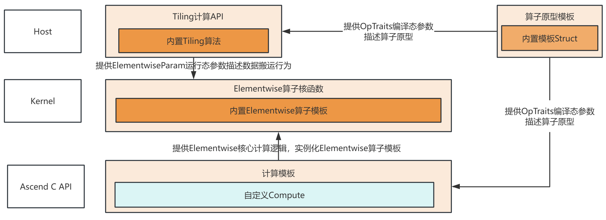<br>

不同计算原理的Elementwise算子在Kernel内部的数据搬运模块并无区别，因此Elementwise的数据交互不涉及Policy的不同Kernel模板实现。

根据Elementwise算子在框架内部的交互场景，ATVC提供如下的接口以及模板类帮助开发搭建自定义Ascend C的Elementwise算子：
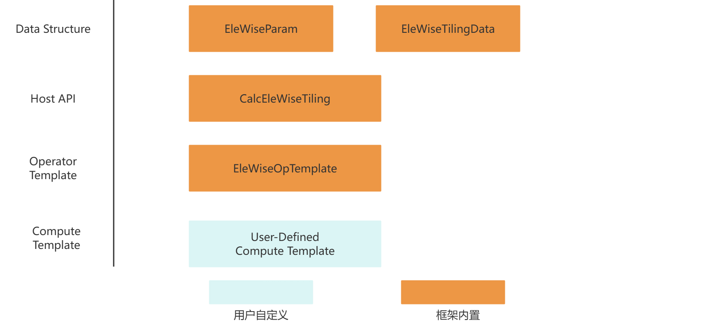<br>
自定义Elementwise算子需按照以下顺序完成模块之间的组装：
1. 定义计算模板。
2. 将计算模板类传入Kernel层算子模板完成核函数功能实现。
3. 定义Kernel层算子入口API，内部实例化计算模板类。


### 3.1.2 Elementwise算子开发步骤
下面将以Sinh算子 $y = \frac{\exp(x) - \exp(-x)}{2}$ 的实现为样例，按照组成Kernel的顺序介绍Elementwise算子开发的关键步骤进行介绍。通过ATVC框架实现的完整SinhCustom算子样例代码见[样例代码](../examples/sinh_custom/sinh_custom.cpp)：
```cpp
// 描述算子的输入输出以及临时计算资源
using SinhOpTraits = ATVC::OpTraits<ATVC::OpInputs<float>, ATVC::OpOutputs<float>, ATVC::OpTemps<float, float>>;
template<class Traits>
// 开发自定义函数名/类名
struct SinhComputeFunc {
    // DataType模板参数，根据实际数据类型个数填写
    template<typename T, typename U>
    // 重载operator公有接口，提供给`ATVC::Kernel::EleWiseOpTemplate`调用
    __aicore__ inline void operator()(AscendC::LocalTensor<T> x,
                                      AscendC::LocalTensor<T> y,
                                      AscendC::LocalTensor<U> tempBuffer1,
                                      AscendC::LocalTensor<U> tempBuffer2)
    {
        // 开发调用AscendC Api自行实现计算仿函数
        uint32_t tiledCnt = y.GetSize(); // 进行单次基块计算的元素个数
        AscendC::Muls(tempBuffer1, x, static_cast<T>(-1), tiledCnt); // tempBuffer1 = -1 * x
        AscendC::Exp(tempBuffer1, tempBuffer1, tiledCnt); // tempbuffer1 = exp(-x)
        AscendC::Exp(tempBuffer2, x, tiledCnt);  // tempbuffer2 = exp(x)
        AscendC::Sub(y, tempBuffer2, tempBuffer1, tiledCnt); // y = exp(x) - exp(-x)
        AscendC::Muls(y, y, static_cast<T>(0.5), tiledCnt); // y = (e^(x) - e^(-x)) / 2 
    }
};
...
template<class OpTraits>
__global__ __aicore__ void SinhCustom(GM_ADDR x, GM_ADDR y, ATVC::EleWiseParam param)
{
    KERNEL_TASK_TYPE_DEFAULT(KERNEL_TYPE_AIV_ONLY); // 控制算子执行时只启动Vector核
    auto op = ATVC::Kernel::EleWiseOpTemplate<SinhComputeFunc<OpTraits>>();
    op.Run(x, y, &param);          // 按照输入、输出、param的顺序传入Run函数中；OpTraits内部的ATVC::OpTemps将由EleWiseOpTemplate内部申请资源，开发无需关注
}
...
// 调用自定义的Kernel API, <<<>>>的BlockNum参数可通过param的TilingData获取
SinhCustom<SinhOpTraits><<<param.tilingData.blockNum, nullptr, stream>>>(xDevice, yDevice, param);
...
```
#### 3.1.2.1 实现计算逻辑
计算模板是用户必须在Elementwise 算子实现过程中完成的一类特殊模板类的定义。模板类无需关注数据如何从GM搬运到UB，只需重载`operator()`的公有接口，并在该仿函数内部实现`AscendC::LocalTensor`之间的计算逻辑。在Kernel层的组装阶段，计算模板将作为模板参数传入`ATVC::Kernel::EleWiseOpTemplate`，并在数据计算阶段被调用。下方为计算模板实现Sinh计算逻辑的代码样例：
```cpp
#include "atvc.h" // 包含所有模板及API的总入口头文件

// 传入编译态参数ATVC::OpTraits
template <class Traits>
// 开发自定义函数名/类名
struct SinhComputeFunc {
    // DataType模板参数，根据实际数据类型个数填写
    template <typename T, typename U>
    // 重载operator公有接口，提供给Kernel::EleWiseOpTemplate调用
    __aicore__ inline void operator()(AscendC::LocalTensor<T> x, AscendC::LocalTensor<T> y, AscendC::LocalTensor<U> tempBuffer1, AscendC::LocalTensor<U> tempBuffer2) {
        // 开发调用AscendC API自行实现计算仿函数
        uint32_t tiledCnt = y.GetSize(); // 进行单次基块计算的元素个数
        AscendC::Muls(tempBuffer1, x, static_cast<T>(-1), tiledCnt); // tempBuffer1 = -1 * x
        AscendC::Exp(tempBuffer1, tempBuffer1, tiledCnt); // tempbuffer1 = exp(-x)
        AscendC::Exp(tempBuffer2, x, tiledCnt);  // tempbuffer2 = exp(x)
        AscendC::Sub(y, tempBuffer2, tempBuffer1, tiledCnt); // y = exp(x) - exp(-x)
        AscendC::Muls(y, y, static_cast<T>(0.5), tiledCnt);  // y = (e^(x) - e^(-x)) / 2 
    }
};
```
计算模板类将在数据计算阶段被算子模板调用，因此计算模板类定义必须遵从以下约束：
1. 该模板类在实例化时固定传入`ATVC::OpTraits`类型的结构体作为模板参数，如 `ATVC::OpTraits<ATVC::OpInputs<float, float>,ATVC::OpOutputs<float>, ATVC::OpTemps<float, float>>`。
2. 开发必须完成公有仿函数`__aicore__ inline void operator()`的重载。`ATVC::Kernel::EleWiseOpTemplate`将在计算阶段调用仿函数完成计算。
3. 开发定义的`operator()`仿函数的输入参数类型支持`AscendC::LocalTensor<T>`以及C++其他基础数据类型。形式参数需按照`ATVC::OpInputs<>`,`ATVC::OpOutputs<>`, `ATVC::OpTemps<>`声明的顺序填入，其他标量参数放在最后，根据用户计算场景按需传入。


#### 3.1.2.2 实例化模板

在Elementwise开发流程中，用户需要自行定义核函数接口。核函数内部通过`ATVC::Kernel::EleWiseOpTemplate`完成模板实例化。

Kernel层的自定义核函数代码样例如下：
```cpp
#include "atvc.h"

using SinhOpTraits = ATVC::OpTraits<ATVC::OpInputs<float>, ATVC::OpOutputs<float>, ATVC::OpTemps<float, float>>;

/*
 * 该函数为SinhCustom算子核函数入口
 * x        Device上的gm地址，指向SinhCustom算子第一个输入
 * y        Device上的gm地址，指向SinhCustom算子第一个输出
 * param    指向运行态ATVC::EleWiseParam数据
*/
template <class OpTraits>
__global__ __aicore__ void SinhCustom(GM_ADDR x, GM_ADDR y, ATVC::EleWiseParam param)
{
    KERNEL_TASK_TYPE_DEFAULT(KERNEL_TYPE_AIV_ONLY); // 控制算子执行时只启动Vector核
    auto op = ATVC::Kernel::EleWiseOpTemplate<SinhComputeFunc<OpTraits>>();
    op.Run(x, y, &param);          // 按照输入、输出、param的顺序传入Run函数中；OpTraits内部的ATVC::OpTemps将由EleWiseOpTemplate内部申请资源，开发无需关注
}
```
<br>

利用ATVC框架开发Elementwise算子的过程中，Kernel层的核函数定义必须遵从以下约束：

1. 核函数必须预留一个GM_ADDR类型的形参用于传入`ATVC::EleWiseParam`运行态参数。
2. 核函数内部必须加入`KERNEL_TASK_TYPE_DEFAULT(KERNEL_TYPE_AIV_ONLY);`这段代码标注算子执行时只启动Vector核。
3. 核函数必须初始化`ATVC::Kernel::EleWiseOpTemplate`变量并调用它的`Run(Args&&... args)`接口来实现数据的调度运算。
4. 若模板参数OpTraits固定（如算子的输入类型不发生变动）的场景，上述的Kernel核函数的定义和调用代码可简化为：
```cpp
using SinhOpTraits = ATVC::OpTraits<ATVC::OpInputs<float>, ATVC::OpOutputs<float>, ATVC::OpTemps<float, float>>;

extern "C" __global__ __aicore__ void SinhCustom(GM_ADDR x, GM_ADDR y, ATVC::EleWiseParam param)
{
    KERNEL_TASK_TYPE_DEFAULT(KERNEL_TYPE_AIV_ONLY);  // 控制算子执行时只启动Vector核
    auto op = ATVC::Kernel::EleWiseOpTemplate<SinhComputeFunc<SinhOpTraits>>(); // 模板参数传入固定的SinhOpTraits
    op.Run(x, y, &param);
}
```

#### 3.1.2.3 Policy与Param的计算与传递
ATVC的Host层提供了Elementwise算子的通用Tiling算法API `ATVC::Host::CalcEleWiseTiling`，它根据算子计算原型`ATVC::OpTraits`以及数据大小计算出包含`ATVC::EleWiseTilingData`的运行态参数`ATVC::EleWiseParam`。`ATVC::EleWiseParam`在运行时将参与模板算子数据搬运从而实现较优计算。<br>`ATVC::EleWiseTilingData`和`ATVC::EleWiseParam`的数据结构定义如下：
```cpp
namespace ATVC{
struct EleWiseTilingData {
    uint32_t tailBlockCnt;  // The number of cores that need to execute an additional loop
    uint32_t tailElemCnt;   // The number of tail block elements
    uint32_t numPerBlock;   // The number of basic blocks to be calculated for each core
    uint32_t tiledCnt;      // The number of basic block elements
    uint32_t blockNum;      // Execute audit
};

struct EleWiseParam {
    EleWiseTilingData tilingData;  // Related parameters affecting data handling
    uint32_t totalCnt = 0;         // The number of elements in a single Tensor
    uint32_t nBufferNum = 2;       // The number of Tensors in each queue
};
}
```


`ATVC::Host::CalcEleWiseTiling`函数内部提供了影响Tiling算法的超参数结构体`EleWiseTilingHyperParam`，支持开发通过修改超参值来探索更好的算子性能。
```cpp
// Host侧调用示例
using SinhOpTraits = ATVC::OpTraits<ATVC::OpInputs<float>, ATVC::OpOutputs<float>, ATVC::OpTemps<float, float>>;
int32_t eleNum = 8 * 2048; // Sinh算子单个输入Tensor含有8*2048个元素
ATVC::EleWiseParam param;

// 计算输入为8*2048个float元素的sinh算子的运行态参数param
if (!ATVC::Host::CalcEleWiseTiling<SinhOpTraits>(eleNum, param)) {
    printf("Elewise tiling error.");
    return -1;
};
```
### 3.1.3 Elementwise模板说明
`ATVC::Kernel::EleWiseOpTemplate`为ATVC框架提供的内置Elementwise基本算子类，它实现了一套算子数据的搬运搬出、资源分配和释放的算子流程。它需要计算模板类作为模板参数传入来完成实例化。核函数通过调用它完成整套计算逻辑：1. 资源初始化; 2.将数据从GM搬运至UB; 3.按`OpTraits`的输入、输出、临时资源描述、其他标量的顺序传入计算模板类的仿函数完成数据的基块计算; 4.将结果从UB搬出至GM。

下方为`ATVC::Kernel::EleWiseOpTemplate`模板类的外部接口介绍，完整模板类定义请参考[`elewise_op_template头文件`](../include/elewise/kernel/elewise_op_template.h)。
```cpp
/*!
 * \brief EleWiseOpTemplate provides templates for element level operations on tensors,
 * including but not limited to addition, subtraction, multiplication, division, as well as
 * mathematical functions such as exponentiation, logarithm, trigonometric functions, etc.
 * The characteristic of this type of operator is that it performs calculation operations
 * element by element without changing the shape of the input data.
 */
template <class EleWiseCompute>
class EleWiseOpTemplate {
public:
    __aicore__ inline EleWiseOpTemplate() {};

    /*!
     * \brief The external running interface of EleWiseOpTemplate mainly completes resource initialization, 
     *        data migration, calculation scheduling, and data migration operations
     * \param src, GM pointer for input data
     * \param dst, Gm pointer for outputting data
     * \param broadcastParam, Dynamic parameters of broadcast, including tiling data, workspace, etc
     */
    template <typename... Args>
    __aicore__ inline void Run(Args&&... args)
    {
        //
        // 完成变长参数的解析和数据调度计算
        //
    }
};
```


`ATVC::Kernel::EleWiseOpTemplate`在核函数实现中的调用样例如下：
```cpp
#include "atvc.h"
// SinhOpTraits 为ATVC对自定义Sinh算子的数据类型描述
using SinhOpTraits = ATVC::OpTraits<ATVC::OpInputs<float>, ATVC::OpOutputs<float>, ATVC::OpTemps<float, float>>;
//核函数内部调用
// ...
{
// 将计算模板类模板定义作为模板参数传入
ATVC::Kernel::EleWiseOpTemplate<SinhComputeFunc<SinhOpTraits>> elewiseTemplate;
// 调用EleWiseOpTemplate的Run接口传入输入x，输出y，Host::CalcEleWiseTiling API的输出param
elewiseTemplate.Run(x, y, &param);
}
```


### 3.1.4 切分策略算法说明
下方为`ATVC::Host::CalcEleWiseTiling`函数内部计算Tiling参数的步骤，详细代码请参考[EleWise Tiling 算法](../include/elewise/host/elewise_host.h)：

- 计算`blockNum`：计算`blockNum` = 总的元素量(`totalCnt`) / 单核数据量基线(`singleCoreBaseLine`), `blockNum`最小值为1， 最大值为平台提供的最大`vectorCore`值。
- 计算达到UB上限的单核单输入元素个数值`ubLimitCnt`：UB上限内存大小 / 所有输入输出及temp单个元素的内存之和。
- 计算`tiledCnt`：
    - 计算每个核需要处理的数据元素量`avgElePerBlock = totalCnt / blockNum`。
    - 根据`avgElePerBlock`所处的`splitDataShape`数据段，按照切分系数去切分基本块： `tiledCnt = dataSplitFactor / dataSplitFactor`。
    - `tiledCnt`调整： 不超上限`ubLimitCnt`， 不小于下限32，且最后的`tiledCnt`要做32元素对齐。
- 计算`tailBlockCnt`：总的基本块数量（`totalCopyCnt`）% block块的数量，即为剩余需要处理的尾块的数量。
- 计算`numPerBlock`：计算每一个block需要处理多少个基本块，即`numPerBlock = totalCopyCnt / blockNum`。
- 计算`tailElemCnt`：通过总元素的数量(`totalCnt`)和基本块元素的数量(`basicCnt`)，计算尾部元素的数量，即`tailElemCnt = totalCnt % basicCnt`。       
```cpp
template <class OpTraits>
bool CalcEleWiseTiling(
    int32_t totalCnt, ATVC::EleWiseParam &param, EleWiseTilingHyperParam hyperParam = EleWiseTilingHyperParam())
{
    int32_t basicCnt = GetEleWiseBasicCnt(hyperParam, totalCnt, blockNum, ubufLimitCnt);
    ...
    param.tilingData.tiledCnt = basicCnt;
    param.totalCnt = totalCnt;
    uint32_t totalCopyCnt = totalCnt / basicCnt;
    param.tilingData.tailBlockCnt = (totalCopyCnt) % blockNum;
    param.tilingData.blockNum = blockNum;
    param.tilingData.numPerBlock = totalCopyCnt / blockNum;  // The number of basic blocks to be transported per block
    param.tilingData.tailElemCnt = totalCnt % basicCnt;      // The number of tail block elements
    ...
};

```


## 3.2 Reduce算子开发


### 3.2.1 Reduce模板概述

ATVC框架提供的Reduce算子模板类的模块之间的交互如下（ATVC框架提供的模板及接口用黄色表示；开发自定义的模块用蓝色表示）：
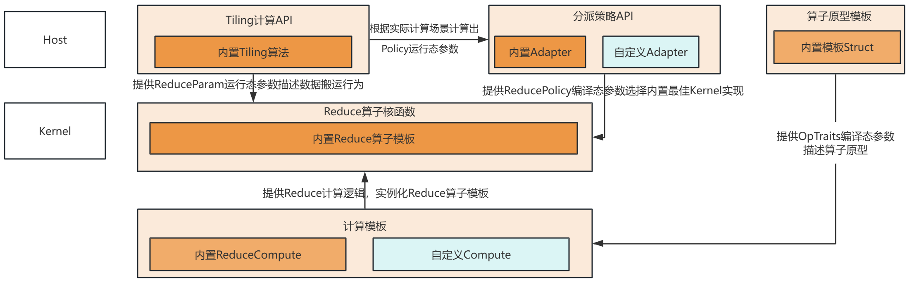<br>
Reduce模板算子内部根据计算的数据大小、Shape、Reduce axis轴完成了不同计算调度的代码实现，ATVC将各种计算调度场景抽象为`ATVC::ReducePolicy`。在算子调用阶段，分派策略API可根据Tiling API计算出的`ATVC::ReducePolicy`转化为编译态参数，结合计算模板来实例化`ATVC::Kernel::ReduceOpTemplate`算子模板类。

根据Reduce算子在框架内部的交互场景，ATVC提供如下的接口以及模板类帮助开发搭建自定义Reduce算子：
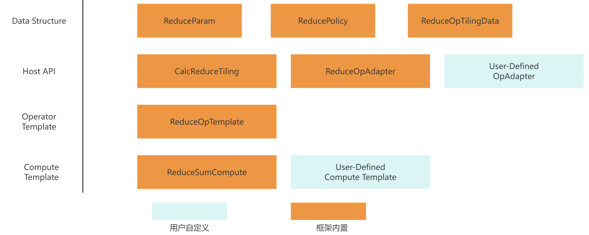<br>
自定义Reduce算子需按照以下顺序完成模块之间的组装：
1. 自定义计算模板/使用框架内置计算模板。
2. 将计算模板传入Kernel层模板算子完成核函数功能实现。
3. 定义Kernel层算子入口API，内部实例化计算模板类。


### 3.2.2 Reduce算子开发步骤
下面将以ReduceSum（对输入Tensor的特定轴上的数据做求和操作）的算子搭建为样例，按照组装顺序介绍Reduce算子类的关键步骤。通过ATVC框架实现的完整ReduceSum算子样例代码见[样例代码](../examples/reduce_sum/reduce_sum.cpp)：
```cpp

// ReduceSum算子的描述：一个输入，一个输出，类型均为float
using ReduceOpTraits =  ATVC::OpTraits<ATVC::OpInputs<float>, ATVC::OpOutputs<float>>;
/*
 * 该函数为ReduceCustom算子核函数入口
 * x                 Device上的gm地址，指向Add算子第一个输入
 * y                 Device上的gm地址，指向Add算子第一个输出
 * reduceParam       指向运行态ATVC::ReduceParam数据
*/
template<typename Traits, const auto& Policy>
__global__ __aicore__ void ReduceCustom(GM_ADDR x, GM_ADDR y, ATVC::ReduceParam reduceParam)
{
    ...
    // 将计算模板类模板定义作为模板参数传入，Policy由Host层的策略分派API给出
    auto op = ATVC::Kernel::ReduceOpTemplate<ATVC::ReduceSumCompute<Traits>, Policy>();
    op.Run(x, y, &reduceParam);
}
int32_t main(int32_t argc, char* argv[])
{
    ...
    ATVC::ReduceParam param;    // Reduce运行态参数，包含TilingData以及临时空间的相关信息
    ATVC::ReducePolicy policy = {-1, -1, -1};  // Reduce运行态参数，负责映射最适合的Reduce模板实现
    ATVC::Host::ReduceTilingHyperParam hyperParam;
    hyperParam.maxInnerA = 256;// 设置maxInnerA为256
    // Host侧调用Tiling API完成相关运行态参数的运算
    if (!ATVC::Host::CalcReduceTiling<ReduceOpTraits>(shape, dim, &policy, &param, hyperParam=hyperParam)) {
        printf("Reduce tiling error.\n");
        return -1;
    };

    // 调用Adapter调度接口，完成核函数的模板调用
    ReduceOpAdapter<ReduceOpTraits>(xDevice, yDevice, param, policy, stream);
    ...
}

```

#### 3.2.2.1 实现计算逻辑
Reduce类的计算模板涉及多核之间的数据结果同步以及核内分块的对齐计算，用户自定义难度较高，因此ATVC框架提供了Reduce类的内置计算模板，并实现了Reduce在单核内与多核间的计算与同步等函数接口。
这类计算模板将作为模板参数传入`ATVC::ReduceOpTemplate`中，并在数据计算以及同步阶段被调用。
下方为ATVC框架内置的`ATVC::ReduceSumCompute`计算模板的伪代码介绍，完整代码定义请参考[reduce_sum.h](../include/reduce/kernel/reduce_sum_compute.h)。
```cpp
#ifndef ATVC_REDUCE_SUM_COMPUTE_H
#define ATVC_REDUCE_SUM_COMPUTE_H

#include "common/kernel_utils.h"
#include "reduce/common/patterns.h"
#include "reduce/utils/reduce_block_aux_util.h"

namespace ATVC {
/*!
 * ReduceSumCompute This class provides the core arithmetic required to reduce
 * tensors along either the inner-most (AR) or outer-most (RA) axis after
 * the tensor has been copied to the Unified Buffer (UB).  Data movement between
 * Global Memory (GM) and UB is not handled here; it is the responsibility of
 * the surrounding scheduling template.
 */
template <typename OpTraits>
class ReduceSumCompute {
public:
    // Extract operator input description information from OpTraits
    using inputDTypeList = typename OpTraits::In::types;
    using DataType = typename ATVC::TypeListGet<inputDTypeList, 0>::Type;
    using PrompteDtype = typename KernelUtils::GetPromoteType<DataType>::T;

    __aicore__ inline ReduceSumCompute()
    {}

    /*!
     * \brief Perform the actual reduction on a tile already resident in UB.
     * \tparam needMask, True when UB alignment introduced invalid lanes.
     * \tparam Pattern, One of ReducePattern::AR or ReducePattern::RA.
     * \param[in] shape, {dimA, dimR} in elements; dimR may be padded.
     * \param[out] dst, Destination tensor (length == dimA)
     * \param[in] src, Source tensor (length == dimA * dimR)
     */
    template <bool needMask, class Pattern>
    __aicore__ inline void
    Compute(KernelUtils::Shape<2> &shape,
            const AscendC::LocalTensor<PrompteDtype> &dst,
            const AscendC::LocalTensor<PrompteDtype> &src)
    {
        // ...
    }

    /*!
     * \brief Merge the calculation results of different data base blocks within a single UB
     * \tparam Pattern  Compile-time pattern tag that decides A vs. B orientation.
     * \tparam V Shape descriptor (encodes dimA and dimB at runtime).
     * \param[in] index, Logical index identifying the data-base block.
     * \param[in] shape, Runtime tensor shape (dimA, dimB).
     * \param[in] tempBuf, UB tensor serving as the reduction cache.
     * \param[in] computeRes, UB tensor holding the newest partial result.
     */
    template <class Pattern, class V>
    __aicore__ inline void UpdateCache(int64_t index, V& shape, const AscendC::LocalTensor<PrompteDtype>& tempBuf,
                                       const AscendC::LocalTensor<PrompteDtype>& computeRes)
    {
        // ...
    }

    /*!
     * \brief Binary reduction between two UB buffers.
     * \      Used for inter-core result merging when workspace staging is required.
     * \param[in] ubTensorLeft, Left operand (in-place result).
     * \param[in] ubTensorRight, Right operand (read-only).
     * \param[in] calCount, Number of elements to reduce.
     */
    __aicore__ inline void
    ReduceBetweenUB(const AscendC::LocalTensor<PrompteDtype> &ubTensorLeft,
                    const AscendC::LocalTensor<PrompteDtype> &ubTensorRight,
                    const int32_t &calCount)
    {
        // ...
    }

    /*!
     * \brief Return the value used for padding when UB alignment is required.
     *        For SUM-reduction the neutral element is 0.
     * \tparam U, Scalar type identical to DataType or PromoteDataType.
     * \return The padding value (always 0).
     */
    template <typename U>
    __aicore__ inline U GetPaddingValue()
    {
        // ...
    }
};
}  // namespace ATVC
#endif  // ATVC_REDUCE_SUM_COMPUTE_H
```
Reduce计算模板类将在数据计算阶段被`ReduceOpTemplate`算子模板调用，因此Reduce计算模板类的实现必须遵从以下约束：

- 该模板类在实例化时固定传入`ATVC::OpTraits`类型的结构体作为模板参数，如`ATVC::OpTraits<ATVC::OpInputs<float>,ATVC::OpOutputs<float>`。
- 开发必须完成以下公有API的内部实现：
    1. 计算单数据基块的Reduce结果 `__aicore__ inline void Compute(...)`。
    2. 计算单UB内不同数据基块的计算结果 `__aicore__ inline void UpdateCache(...)`。
    3. 计算多核之间&同一核内的多次UB结果 `__aicore__ inline void ReduceBetweenUB(...)`。
    4. 返回非对齐场景不参与计算的尾部数据的填充值 `__aicore__ inline U GetPaddingValue()`。

#### 3.2.2.2 实例化模板
在Reduce开发流程中，用户需要定义封装核函数接口。核函数内部通过`ATVC::Kernel::ReduceOpTemplate`完成模板实例化。
Kernel层的自定义API样例如下：
```cpp
#include "atvc.h"

using ReduceOpTraits = ATVC::OpTraits<ATVC::OpInputs<float>, ATVC::OpOutputs<float>>;

/*
 * 该函数为ReduceCustom算子核函数入口
 * x                 Device上的gm地址，指向ReduceCustom算子第一个输入
 * y                 Device上的gm地址，指向ReduceCustom算子第一个输出
 * reduceParam       指向运行态ATVC::ReduceParam数据
*/
__global__ __aicore__ void ReduceCustom(GM_ADDR x, GM_ADDR y, ATVC::ReduceParam reduceParam)
{
    KERNEL_TASK_TYPE_DEFAULT(KERNEL_TYPE_MIX_AIV_1_0); // 使用了多核控制指令，设置算子执行时只启动Vector核
    // 将计算模板类模板定义作为模板参数传入，Policy由Host层的策略分派API给出
    auto op = ATVC::Kernel::ReduceOpTemplate<ATVC::ReduceSumCompute<Traits>, Policy>();
    op.Run(x, y, &reduceParam);
}
```
<br>

Reduce算子开发场景下，核函数定义必须遵从以下约束：
1. 核函数须预留一个GM_ADDR类型的形参用于传入`ATVC::ReduceParam`运行态参数。
2. 核函数须加入`KERNEL_TASK_TYPE_DEFAULT(KERNEL_TYPE_MIX_AIV_1_0);`这段代码显示标注算子类型。
3. 核函数须实例化`ATVC::Kernel::ReduceOpTemplate`变量并调用它的`Run(GM_ADDR x, GM_ADDR y, ATVC::ReduceParam* param)`接口来实现数据的调度运算。


#### 3.2.2.3 Policy与Param的计算与传递
##### 3.2.2.3.1 CalcReduceTiling
`ATVC::Host::CalcReduceTiling`是ATVC在Host侧提供的针对Reduce类算子的通用Tiling API，它以算子计算模板`ATVC::OpTraits`作为模板参数，根据实际计算场景得出`ATVC::ReduceParam`以及对应算子模板实现的`ATVC::ReducePolicy`。
`ATVC::ReduceParam`用于保存Reduce数据计算搬运的，`ATVC::ReduceTilingData`以及临时空间的资源变量，它们的数据结构定义如下：

```cpp
//指导Reduce算子内部的数据调度
struct ReduceTilingData {
    uint64_t factorACntPerCore; // 在每个核上不参与计算的非Reduce轴实际维度
    uint64_t factorATotalCnt;   // 不参与计算的非Reduce轴总维度
    uint64_t ubFactorA;         // 单UB内非Reduce轴的数据量
    uint64_t factorRCntPerCore; // 在每个核上参与计算的Reduce轴实际维度
    uint64_t factorRTotalCnt;   // 参与计算的Reduce轴总维度
    uint64_t ubFactorR;         // 单UB内参与计算的Reduce轴维度
    uint64_t groupR;            // 切轴为R轴，该轴上切点外的R的相对数据量
    uint64_t outSize;           // 切轴外的AR数据总量
    uint64_t basicBlock;        // 基础数据块大小
    int32_t coreNum;            // 执行核数
    float meanVar;
    uint64_t shape[MAX_DIM];        //  shape信息
    uint64_t stride[MAX_DIM];       //  输入数据搬运步长
    uint64_t dstStride[MAX_DIM];    // 输出数据搬运步长
};

struct ReduceParam {
    uint64_t workspaceAddr; // device侧的申请空间地址
    uint32_t workspaceSize = 0; // tiling侧需要申请的工作空间大小,单位比特
    ReduceTilingData tilingData; // 影响数据搬运的相关参数
    uint32_t nBufferNum = 2; // 每个Queue中的Tensor数量
};
```

`ATVC::Host::CalcReduceTiling`函数内部提供了影响Tiling算法的超参数结构体`ReduceTilingHyperParam`，支持开发通过修改超参值来探索更好的算子性能。该API调用样例如下，详细代码请参考[Reduce Tiling 算法](../include/reduce/host/reduce_host.h)：
```cpp
/*!
 * \brief Calculate the TilingData and policy parameters for Reduce.
 * \param[in] inputShape, shape of the tensor.
 * \param[in] reduceDim, The dim that requires a Reduce operation.
 * \param[out] policy, static policy of Reduce Template
 * \param[out] param, dynamic param of Reduce Template
 * \return bool Return true to indicate calculation success, false to indicate failure.
 */
template<class OpTraits>
bool CalcReduceTiling(std::vector<int64_t> inputShape,
                      std::vector<int64_t> reduceDim,
                      ReducePolicy* policy,
                      ReduceParam* param,
                      ReduceTilingHyperParam hyperParam = ReduceTilingHyperParam())
{
    // ...
}

// Host侧调用示例
using ReduceOpTraits = ATVC::OpTraits<ATVC::OpInputs<float>, ATVC::OpOutputs<float>>;
int32_t main(int32_t argc, char* argv[])
{
    std::vector<int64_t> dim{0};
    std::vector<int64_t> shape{8, 1024};
    ATVC::ReduceParam param;
    ATVC::ReducePolicy policy = {-1, -1, -1};
    if (!ATVC::Host::CalcReduceTiling<ReduceOpTraits>(shape, dim, &param, &policy)) {
        printf("Reduce tiling error.");
        return -1;
    };
    ... // kernel调用，传入CalcReduceTiling计算得到的param和policy
}
```

##### 3.2.2.3.2 ReduceOpAdapter
在调用CalcReduceTiling接口获取动态参数`ATVC::ReducePolicy`后，仍需要在Kernel直调阶段将其转化为编译态参数来实例化`ReduceOpTemplate`模板完成调用。ATVC框架对`ATVC::ReducePolicy`这特殊的模板参数提供了一套运行态参数转编译态参数的策略分派机制`ReduceOpAdapter`，它将框架`CalcReduceTiling`的输出作为输入，替用户完成`ATVC::ReduceParam`资源的申请及释放的同时，将运行态的`ATVC::ReducePolicy`参数转化为模板参数完成自定义核函数的策略选择调用。
基于[3.2.2.2](#3222-实例化模板) 章节中核函数的接口定义，ATVC框架只给出`ReduceOpAdapter`的示范代码，用户亦可根据实际计算场景替换其中的核函数调用：

```cpp
// 当前ATVC框架支持的Reduce类算子的不同模板参数
static constexpr ATVC::ReducePolicy REDUCE_POLICY0 { ATVC::AR_PATTERN::A, ATVC::AR_COUNT::A1R0, 0 };
static constexpr ATVC::ReducePolicy REDUCE_POLICY1 { ATVC::AR_PATTERN::AR, ATVC::AR_COUNT::A0R1, 10 };
static constexpr ATVC::ReducePolicy REDUCE_POLICY2 { ATVC::AR_PATTERN::AR, ATVC::AR_COUNT::A1R0, 0 };
static constexpr ATVC::ReducePolicy REDUCE_POLICY3 { ATVC::AR_PATTERN::AR, ATVC::AR_COUNT::A1R0, 1 };

// ReduceOpAdapter函数定义
// 负责Reduce类算子的调度，选择对应的Policy最佳策略并执行Kernel函数
template <class OpTraits>
void ReduceOpAdapter(uint8_t* x, uint8_t* y, ATVC::ReduceParam &param, ATVC::ReducePolicy &policy, aclrtStream& stream)
{
    // 申请临时空间workspace，并将其与ReduceTilingData一同传到Device侧
    uint8_t *workspaceDevice;
    CHECK_ACL(aclrtMalloc((void **)&workspaceDevice, param.workspaceSize, ACL_MEM_MALLOC_HUGE_FIRST));
    param.workspaceAddr = reinterpret_cast<uint64_t>(workspaceDevice);
    // 将tiling api计算出的ReducePolicy转化为编译态参数并实例化相应的核函数
    if (policy == ATVC::REDUCE_POLICY0) {
        ReduceCustom<OpTraits, ATVC::REDUCE_POLICY0><<<param.tilingData.coreNum, nullptr, stream>>>(x, y, param);
     }else if (policy == ATVC::REDUCE_POLICY1) {
        ReduceCustom<OpTraits, ATVC::REDUCE_POLICY1><<<param.tilingData.coreNum, nullptr, stream>>>(x, y, param);
    } else if (policy == ATVC::REDUCE_POLICY2) {
        ReduceCustom<OpTraits, ATVC::REDUCE_POLICY2><<<param.tilingData.coreNum, nullptr, stream>>>(x, y, param);
    } else if (policy == ATVC::REDUCE_POLICY3) {
        ReduceCustom<OpTraits, ATVC::REDUCE_POLICY3><<<param.tilingData.coreNum, nullptr, stream>>>(x, y, param);
    } else {
        printf("[ERROR] Cannot find any matched policy.\n");
    }
    // 流同步后释放申请的param内存
    CHECK_ACL(aclrtSynchronizeStream(stream));
    CHECK_ACL(aclrtFree(workspaceDevice));
}

using ReduceOpTraits = ATVC::OpTraits<ATVC::OpInputs<float>, ATVC::OpOutputs<float>>;
// Host侧函数调用
{
    // ...
    ATVC::ReduceParam param;
    ATVC::ReducePolicy policy = {-1, -1, -1};
    if (!ATVC::Host::CalcReduceTiling<ReduceOpTraits>(inputShape, reduceDim, &policy, &param))
    {
        printf("Reduce tiling error.");
        return -1;
    };
    // Acl 初始化
    aclrtStream stream = nullptr;
    CHECK_ACL(aclrtCreateStream(&stream));
    uint8_t *xDevice, *yDevice;
    // 完成输入输出的内存分配以及将输入数据搬运到device上的操作
    // ...
    // 调用策略分派接口，接口内部完成核函数直调
    ReduceOpAdapter<ReduceOpTraits>(xDevice, yDevice, param, policy, stream);
}
```

### 3.2.3 Reduce模板说明
`ATVC::Kernel::ReduceOpTemplate`是一套基本的Reduce算子类，它实现了一套算子数据的搬运搬出、资源分配和释放的流程。Kernel层的算子模板需要计算模板类作为模板参数传入来完成实例化。在调用阶段，算子类将按照固定参数顺序调用计算模板类的对应接口，完成数据的计算。
相比Elementwise算子模板不同的是，ReduceOpTemplate内置了不同场景的Reduce实现，并在编译时通过`ATVC::ReducePolicy`类型的结构体来实现实例化。ReduceOpTemplate内部将根据模板参数决定数据将由哪类具体的模板实例计算。`ATVC::ReducePolicy`的数据定义如下：

```cpp
struct ReducePolicy {
    int32_t patternID = -1;             // 描述Reduce轴与数据原本shape之间的关系
    int32_t loopARCount = -1;           // 描述Reduce轴在多核之间的计算模式
    int32_t loopInnerARCount = -1;      // 描述Reduce轴在单核之内的计算模式
};
```

下方为`ATVC::Kernel::ReduceOpTemplate`模板类的外部接口介绍，完整模板类定义请参考[Reduce模板](../include/reduce/kernel/reduce_op_template.h)。
```cpp
/*!
 * ReduceOpTemplate Generic Reduce operator template.
 * Reduce operators usually refer to operators that perform reduction operations on elements in tensors,
 * such as summation and averaging. They can specify several dimensions for reduction calculations,
 * or reduce all elements to a scalar.
 */
template <class ReduceCompute, const auto& SelectReducePolicy, 
            class PreCompute = void, class PostCompute = void>
class ReduceOpTemplate {
public:
    __aicore__ inline ReduceOpTemplate() {};

    /*!
     * \brief The input order is: input tensor, output tensor, ReduceParam, Other scalars.
     *        Internally schedule data based on ReduceParam and call ReduceOpTemplate to complete
     *        the calculation before moving it out to GM.
     * \param[in] x, GM address of the input tensor.
     * \param[in] y, GM address of the output tensor.
     * \param[in] param, tiling data and policy.
     * \return void.
     */
    template<typename ...Args>
    __aicore__ inline void Run(GM_ADDR x, GM_ADDR y, ReduceParam* param)
    {
        // ...
    }
};
```


`ATVC::Kernel::ReduceOpTemplate`的调用样例如下：
```cpp
#include "atvc.h"
// ReduceSum算子的描述：一个输入，一个输出，类型均为float
using ReduceOpTraits =  ATVC::OpTraits<ATVC::OpInputs<float>, ATVC::OpOutputs<float>>;

template <typename Traits, const auto& Policy>
__global__ __aicore__ void ReduceCustom(GM_ADDR x, GM_ADDR y, ATVC::ReduceParam reduceParam)
{
    KERNEL_TASK_TYPE_DEFAULT(KERNEL_TYPE_MIX_AIV_1_0); // 使用了多核控制指令，设置算子执行时只启动Vector核
    // 将计算模板类模板定义作为模板参数传入，Policy由Host层的策略分派API给出
    auto op = ATVC::Kernel::ReduceOpTemplate<ATVC::ReduceSumCompute<Traits>, Policy>();
    op.Run(x, y, &reduceParam);
}
```


## 3.3 Broadcast算子开发

### 3.3.1 Broadcast模板概述
ATVC框架提供的Broadcast算子模板类的模块之间的交互如下（ATVC框架提供的模板及接口用黄色表示；开发自定义的模块用蓝色表示）：
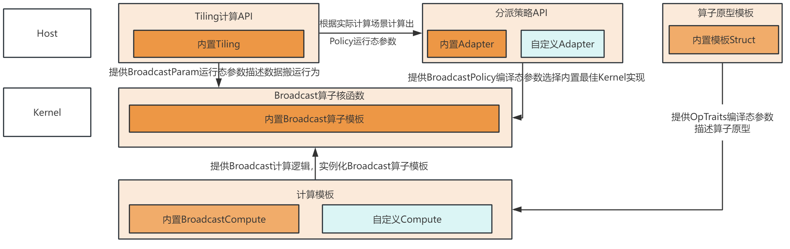<br>
Broadcast模板算子内部根据数据类型、输入/输出Shape完成某个轴上数据扩充的功能，ATVC将各种计算调度场景抽象为`ATVC::BroadcastPolicy`。在算子调用阶段，分派策略API可根据Tiling API计算出的`ATVC::BroadcastPolicy`转化为编译态参数，结合计算模板来实例化`ATVC::Kernel::BroadcastOpTemplate`算子模板类。

根据Broadcast算子在框架内部的交互场景，ATVC提供如下的接口以及模板类帮助开发搭建自定义Broadcast算子：
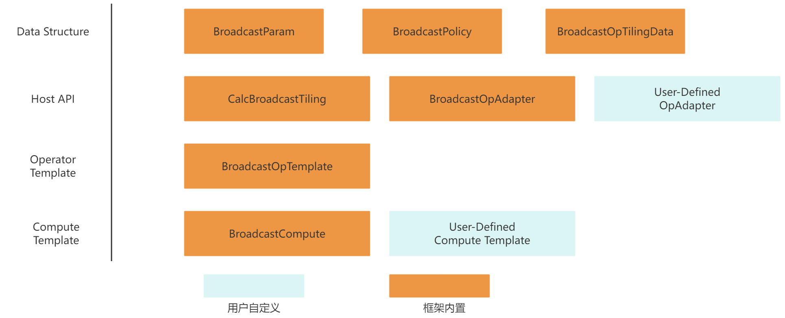<br>
自定义Broadcast算子需按照以下顺序完成模块之间的组装：
1. 自定义计算模板/使用框架内置计算模板。
2. 将计算模板传入Kernel层模板算子完成核函数功能实现。
3. 定义Kernel层算子入口API，内部实例化计算模板类。


### 3.3.2 Broadcast算子开发步骤
下面将以BroadcastTo（对输入Tensor在特定轴上做数据复制扩充操作）的算子搭建为样例，按照组装顺序介绍Broadcast类算子的关键步骤。通过ATVC框架实现的完整BroadcastCustom算子样例代码见[样例代码](../examples/broadcast_to/broadcast_to.cpp)：
```cpp
// BroadcastTo算子的描述：一个输入，一个输出，类型均为float
using BroadcastOpTraits = ATVC::OpTraits<ATVC::OpInputs<float>, ATVC::OpOutputs<float>>;

/*
 * 该函数为BroadcastCustom算子核函数入口
 * x                 Device上的gm地址，指向BroadcastCustom算子第一个输入
 * y                 Device上的gm地址，指向BroadcastCustom算子第一个输出
 * broadcastParam    指向运行态ATVC::BroadcastParam数据
*/
template<typename Traits, const auto& Policy>
__global__ __aicore__ void BroadcastCustom(GM_ADDR x, GM_ADDR y, ATVC::BroadcastParam broadcastParam)
{
    ...
    // 将计算模板类模板定义作为模板参数传入，Policy由Host层的策略分派API给出
    auto op = ATVC::Kernel::BroadcastOpTemplate<ATVC::BroadcastCompute<Traits>, Policy>();
    ATVC::BroadcastParam *param = &broadcastParam;
    op.Run(x, y, param);
}

int32_t main(int32_t argc, char* argv[])
{
    ...
    ATVC::BroadcastParam param;    // Broadcast运行态参数，包含TilingData以及临时空间的相关信息
    ATVC::BroadcastPolicy policy = {-1, -1, -1};  // Broadcast运行态参数，负责映射最适合的Broadcast模板实现
    // Host侧调用Tiling API完成相关运行态参数的运算
    if (!ATVC::Host::CalcBroadcastTiling<BroadcastOpTraits>(shapeIn, shapeOut, &policy, &param)) {
        printf("Broadcast tiling error.\n");
        return -1;
    };
    // 调用Adapter调度接口，完成核函数的模板调用
    BroadcastOpAdapter<BroadcastOpTraits>(xDevice, yDevice, param, policy, stream);
    ...
}

```

#### 3.3.2.1 实现计算逻辑
Broadcast计算模板是指Broadcast类算子在UB上实现将A轴的数据复制扩充到B轴上。在Kernel层的组装阶段，计算模板将作为模板参数传入`ATVC::Kernel::BroadcastOpTemplate`，并在数据计算阶段被调用。
下方为ATVC框架内置的`ATVC::BroadcastCompute`计算模板的伪代码介绍，完整代码定义请参考[完整代码](../include/broadcast/kernel/broadcast_compute.h)。
```cpp
#ifndef ATVC_BROADCAST_COMPUTE_H
#define ATVC_BROADCAST_COMPUTE_H
#include "kernel_operator.h"
#include "common/kernel_utils.h"
#include "broadcast/common/broadcast_common.h"

namespace ATVC {
template <class OpTraits>
class BroadcastCompute {
public:
    using inputDTypeList = typename OpTraits::In::types;
    using DataType = typename ATVC::TypeListGet<inputDTypeList, 0>::Type;

    template <int32_t patternID>
    __aicore__ inline void Compute(AscendC::LocalTensor<DataType> &src, uint32_t inputOffset,
                                   AscendC::LocalTensor<DataType> &dst, uint32_t dimA, uint32_t dimB)
    {
        // 实现AB、BA两个场景的broadcast计算
    }
};
}
#endif // ATVC_BROADCAST_COMPUTE_H
```
Broadcast计算模板类将在数据计算阶段被`BroadcastOpTemplate`算子模板调用，因此Broadcast计算模板类的实现必须遵从以下约束：

- 该模板类的`Compute`接口主要实现将UB上某一段输入数据进行B轴上的复制扩充。
- `Compute`参数说明：
    * `src`: 是存放UB上的输入数据。
    * `inputOffset`: 表示本次compute需要计算的一段数据段位于`src`的起始位置偏移量。
    * `dst`: 是存放计算后的UB上的输出数据。
    * `dimA`: 表示此次计算需要处理的输入数据长度。
    * `dimB`: 表示此次计算需要扩充的长度，输入为dimA, 输出数据量为dimA*dimB。
- `Compute`需要完成AB和BA两种场景的计算：
    * AB场景的计算：输入`src`是一个Shape为(dimA, 1)的Tensor，需要将数据扩充到`dst`上，dst的Shape是(dimA, dimB)。
    * BA场景的计算：输入`src`是一个Shape为(1, dimA)的Tensor，需要将src数据扩充到`dst`上，dst的Shape是(dimB, dimA)。

- 该模板类在实例化时固定传入`ATVC::OpTraits`类型的结构体作为模板参数，如`ATVC::OpTraits<ATVC::OpInputs<float>,ATVC::OpOutputs<float>`。

#### 3.3.2.2 实例化模板
在ATVC提供了Broadcast内部实现后，用户需要定义封装核函数接口。核函数内部通过`ATVC::Kernel::BroadcastOpTemplate`完成模板实例化。
Kernel层的自定义API样例如下：
```cpp
#include "atvc.h"

// BroadcastTo算子的描述：一个输入，一个输出，类型均为float
using BroadcastOpTraits =  ATVC::OpTraits<ATVC::OpInputs<float>, ATVC::OpOutputs<float>>;

/*
 * 该函数为BroadcastCustom算子核函数入口
 * x                 Device上的gm地址，指向BroadcastTo算子第一个输入
 * y                 Device上的gm地址，指向BroadcastTo算子第一个输出
 * broadcastParam    指向运行态ATVC::BroadcastParam数据
*/
template <typename Traits, const auto& Policy>
__global__ __aicore__ void BroadcastCustom(GM_ADDR x, GM_ADDR y, ATVC::BroadcastParam broadcastParam)
{
    KERNEL_TASK_TYPE_DEFAULT(KERNEL_TYPE_AIV_ONLY); // 设置算子执行时只启动Vector核
    // 将计算模板类模板定义作为模板参数传入，Policy由Host层的策略分派API给出
    auto op = ATVC::Kernel::BroadcastOpTemplate<ATVC::BroadcastCompute<Traits>, Policy>();
    op.Run(x, y, &broadcastParam);
}
```
<br>

Broadcast算子开发场景下，核函数定义必须遵从以下约束：
1. 核函数须预留一个GM_ADDR类型的形参用于传入`ATVC::BroadcastParam`运行态参数。
2. 核函数须加入`KERNEL_TASK_TYPE_DEFAULT(KERNEL_TYPE_AIV_ONLY);`这段代码显示标注算子类型。
3. 核函数须实例化`ATVC::Kernel::BroadcastOpTemplate`变量,实例化时需传入对应的计算实现模板类`ATVC::BroadcastCompute`，并调用它的`Run(GM_ADDR x, GM_ADDR y, ATVC::BroadcastParam* broadcastParam)`接口来实现数据的调度运算。

#### 3.3.2.3 Policy与Param的计算与传递
##### 3.3.2.3.1 CalcBroadcastTiling
`ATVC::Host::CalcBroadcastTiling`是ATVC在Host侧提供的针对Broadcast类算子的通用Tiling API，它以`ATVC::OpTraits`作为模板参数，根据实际输入输出Shape计算出对应算子模板需要的静态编译参数`ATVC::BroadcastPolicy`<br>和动态参数`ATVC::BroadcastParam`，其中`ATVC::BroadcastParam`包含了数据计算搬运的`ATVC::BroadcastTilingData`，它们的数据结构定义如下：

```cpp
//指导Broadcast算子模板内部的数据调度
struct BroadcastOpTilingData {
    uint64_t A0;                    // A轴数据在核间的切分数
    uint64_t A11;                   // 核内A轴数据在UB间的切分数
    uint64_t A12;                   // UB内A轴数据计算切分数
    uint64_t A2;                    // 单次计算的A轴数据量
    uint64_t B0;                    // B轴数据在核间的切分数
    uint64_t B1;                    // 核内B轴数据在UB间的切分数
    uint64_t B2;                    // 单次计算的B轴数据量
    uint64_t factorACntPerCore;     // 每个核上的A轴数据量
    uint64_t factorATotalCnt;
    uint64_t factorBCntPerCore;     // 每个核上的B轴数据量
    uint64_t factorBTotalCnt;
    uint64_t basicBlock;            // 基本数据量大小
    int32_t coreNum;                // 启动的核数
    uint64_t shape[ATVC::MAX_DIM];      // 输入shape
    uint64_t dstShape[ATVC::MAX_DIM];   // 输出shape
    uint64_t stride[ATVC::MAX_DIM];     // 输入各维相邻数据块间的地址步长
    uint64_t dstStride[ATVC::MAX_DIM];  // 输出各维相邻数据块间的地址步长
};

struct BroadcastParam {
    uint64_t workspaceAddr;             // device侧的申请空间地址
    uint32_t workspaceSize = 0;          // tiling计算出来的kernel计算所需的工作空间大小,单位比特
    BroadcastOpTilingData tilingData;    // 数据切分策略的相关参数
    int32_t nBufferNum = 2;              // 并行流水数
};
```

`ATVC::Host::CalcBroadcastTiling`函数内部支持开发通过修改超参值来探索更好的算子性能。该API调用样例如下，详细代码请参考[Broadcast Tiling 算法](../include/broadcast/host/broadcast_host.h)：
```cpp
namespace ATVC {
namespace Host {
/*!
 * \brief Generates tiling parameters and policy for the Broadcast Template.
 * \param[in] shapeIn , Source tensor shape (may be broadcast to match `shapeOut`).
 * \param[in] shapeOut, Destination tensor shape after broadcasting.
 * \param[out] policy, static policy of Broadcast Template.
 * \param[out] param, dynamic param of Broadcast Template.
 * \return true – successfully, false – error.
 */
template<class OpTraits, class PreComputeTraits = void, class PostComputeTraits = void>
bool CalcBroadcastTiling(std::vector<int64_t> shapeIn,
                         std::vector<int64_t> shapeOut,
                         BroadcastPolicy* policy,
                         BroadcastParam* param)
{
    using inputDTypeList = typename OpTraits::In::types;
    using DataType = typename ATVC::TypeListGet<inputDTypeList, 0>::Type;
    auto inputDtype = GetOriInputType<DataType>();
    BroadcastTilingInputParam opInput = {shapeIn, shapeOut, inputDtype};
    OpTiling::BroadcastOpTiling tiling(opInput, policy, param);
    if(!tiling.Run()) {
        printf("[ERROR] Tiling Error\n");
        return false;
    }
    return true;
};
} // Host
} // ATVC

// BroadcastTo算子的描述：一个输入，一个输出，类型均为float
using BroadcastOpTraits =  ATVC::OpTraits<ATVC::OpInputs<float>, ATVC::OpOutputs<float>>;

int32_t main(int32_t argc, char* argv[])
{
    std::vector<int64_t> shapeIn{1, 1024};    // 测试输入shape
    std::vector<int64_t> shapeOut{8, 1024};    // 测试输出shape
    ATVC::BroadcastParam param;    // Broadcast运行态参数，包含TilingData以及临时空间的相关信息
    ATVC::BroadcastPolicy policy = {-1, -1, -1};  // Broadcast运行态参数，负责映射最适合的Broadcast模板实现
    // Host侧调用Tiling API完成相关运行态参数的运算
    if (!ATVC::Host::CalcBroadcastTiling<BroadcastOpTraits>(shapeIn, shapeOut, &policy, &param)) {
        printf("Broadcast tiling error.\n");
        return -1;
    };

    // 调用kernel算子接口， 传入CalcBroadcastTiling计算得到的param和policy
    ...
}
```
##### 3.3.2.3.2 BroadcastOpAdapter
在调用CalcBroadcastTiling接口获取动态参数`ATVC::BroadcastPolicy`后，仍需要在Kernel直调阶段将其转化为编译态参数来实例化`BroadcastOpTemplate`模板完成调用。ATVC框架对`ATVC::BroadcastPolicy`这特殊的模板参数提供了一套运行态参数转编译态参数的策略分派机制`BroadcastOpAdapter`，它将框架`CalcBroadcastTiling`的计算得到的输出作为输入，替用户完成`ATVC::BroadcastParam`资源的申请及释放的同时，将运行态的`ATVC::BroadcastPolicy`参数转化为模板参数完成自定义核函数的策略选择调用。
基于[3.3.2.2](#3322-实例化模板)章节中核函数的接口定义，这里只给出`BroadcastOpAdapter`的示范代码，用户亦可根据实际计算场景替换其中的核函数调用：

```cpp
// 负责Broadcast类算子的调度，选择对应的Policy最佳策略并执行Kernel函数
template <class OpTraits>
void BroadcastOpAdapter(uint8_t* x, uint8_t* y, ATVC::BroadcastParam &param, ATVC::BroadcastPolicy &policy, aclrtStream& stream)
{
    // 申请临时空间workspace，并将其与BroadcastTilingData一同传到Device侧
    uint8_t *paramDevice;
    uint8_t *workspaceDevice;
    CHECK_ACL(aclrtMalloc((void **)&workspaceDevice, param.workspaceSize, ACL_MEM_MALLOC_HUGE_FIRST));
    param.workspaceAddr = reinterpret_cast<uint64_t>(workspaceDevice);
    auto broadcastParamSize = sizeof(param);
    CHECK_ACL(aclrtMalloc((void**)&paramDevice, broadcastParamSize, ACL_MEM_MALLOC_HUGE_FIRST));
    CHECK_ACL(aclrtMemcpy(paramDevice, broadcastParamSize, reinterpret_cast<uint8_t*>(&param), broadcastParamSize, ACL_MEMCPY_HOST_TO_DEVICE));
    // 将tiling api计算出的BroadcastPolicy转化为编译态参数并实例化相应的核函数
    if (policy == ATVC::BROADCAST_POLICY0) {
        BroadcastCustom<OpTraits, ATVC::BROADCAST_POLICY0><<<param.tilingData.coreNum, nullptr, stream>>>(x, y, paramDevice);
     }else if (policy == ATVC::BROADCAST_POLICY1) {
        BroadcastCustom<OpTraits, ATVC::BROADCAST_POLICY1><<<param.tilingData.coreNum, nullptr, stream>>>(x, y, paramDevice);
    } else {
        printf("[ERROR] Cannot find any matched policy.\n");
    }
    // 流同步后释放申请的param内存
    CHECK_ACL(aclrtSynchronizeStream(stream));
    CHECK_ACL(aclrtFree(workspaceDevice));
    CHECK_ACL(aclrtFree(paramDevice));
}

int32_t main(int32_t argc, char* argv[])
{
    // acl资源初始化
    ...
    ATVC::BroadcastParam param;    // Broadcast运行态参数，包含TilingData以及临时空间的相关信息
    ATVC::BroadcastPolicy policy = {-1, -1, -1};  // Broadcast运行态参数，负责映射最适合的Broadcast模板实现
    // Host侧调用Tiling API完成相关运行态参数的运算
    (void)ATVC::Host::CalcBroadcastTiling<BroadcastOpTraits>(shapeIn, shapeOut, &policy, &param);

    // 调用Adapter调度接口，完成核函数的模板调用
    BroadcastOpAdapter<BroadcastOpTraits>(xDevice, yDevice, param, policy, stream);

    // 释放Acl资源
    ...
    return 0;
}

```
### 3.3.3 Broadcast模板说明
`ATVC::Kernel::BroadcastOpTemplate`是一套基本的Broadcast算子类，它实现了一套算子数据的搬运搬出、资源分配和释放的流程。Kernel层的算子模板需要计算模板类作为模板参数传入来完成实例化。在调用阶段，Broadcast算子模板将按照固定参数顺序调用计算模板类的`Compute`接口，完成数据的计算。
与Broadcast算子模板类似，Broadcast算子模板内置了不同场景的Broadcast实现，并在编译时通过`ATVC::BroadcastPolicy`类型的结构体来实现实例化。Broadcast算子模板内部将根据模板参数决定数据将由哪类具体的模板实例计算。`ATVC::BroadcastPolicy`的数据定义如下：

```cpp
struct BroadcastPolicy {
    public:
    int32_t patternID = -1;         // 描述需要Broadcast的轴信息
    int32_t loopABCount = -1;       // 描述Broadcast在多核上的切分信息
    int32_t loopInnerABCount = -1;  // 描述Broadcast在UB间的切分信息
};
```

下方为`ATVC::Kernel::BroadcastOpTemplate`模板类的外部接口介绍，完整模板类定义请参考[broadcast_op_template.h](../include/broadcast/kernel/broadcast_op_template.h)。
```cpp
#ifndef ATVC_BROADCAST_OP_TEMPLATE_H
#define ATVC_BROADCAST_OP_TEMPLATE_H
#include "common/const_def.h"
#include "broadcast/utils/broadcast_buf_pool.h"
namespace ATVC {
namespace Kernel {
/*!
 * BroadcastCompute: Used to implement element wise operations between tensors when their shapes are inconsistent.
 * By copying data in a dimension of length 1, the shapes of two tensors are aligned to support element wise
 * addition operations.
*/
template <class BroadcastCompute, const auto& SelectBroadcastPolicy, class PreCompute = void, class PostCompute = void>
class BroadcastOpTemplate {
public:
    using DataType = typename BroadcastCompute::DataType;
    __aicore__ inline BroadcastOpTemplate() {}

    /*!
     * \brief The external running interface of BroadcastOpTemplate mainly completes resource initialization, 
     *        data migration, calculation scheduling and data migration operations
     * \param src, GM pointer for input data
     * \param dst, GM pointer for output data
     * \param broadcastParam, dynamic parameters of broadcast, including tiling data, workspace, etc
     */
    template<typename ...Args>
    __aicore__ inline void Run(Args&&... args)
    {
        // ...
    }

    AscendC::GlobalTensor<DataType> srcGlobal_;
    AscendC::GlobalTensor<DataType> dstGlobal_;
    BroadcastCompute compute_;
    __gm__ BroadcastParam *param_;
};
} // namespace Kernel
} // namespace ATVC
#endif // ATVC_BROADCAST_OP_TEMPLATE_H
```


`ATVC::Kernel::BroadcastOpTemplate`的调用样例如下：
```cpp
#include "atvc.h"
// BroadcastTo算子的描述：一个输入，一个输出，类型均为float
using BroadcastOpTraits =  ATVC::OpTraits<ATVC::OpInputs<float>, ATVC::OpOutputs<float>>;

template <typename Traits, const auto& Policy>
__global__ __aicore__ void BroadcastCustom(GM_ADDR x, GM_ADDR y, ATVC::BroadcastParam broadcastParam)
{
    KERNEL_TASK_TYPE_DEFAULT(KERNEL_TYPE_AIV_ONLY); // 设置算子执行时只启动Vector核
    // 将计算模板类模板定义作为模板参数传入，Policy由Host层的策略分派API给出
    auto op = ATVC::Kernel::BroadcastOpTemplate<ATVC::BroadcastCompute<Traits>, Policy>();
    op.Run(x, y, &broadcastParam);
}
```

## 3.4 Elementwise + Broadcast组合算子开发
### 3.4.1 组合模板概述
ATVC框架支持Broadcast与Elementwise组合的算子通过扩展BroadcastOpTemplate的模板参数对用户提供接口，开发者可以根据算子实际需求来定制组合，框架支持以下组合：Elementwise + Broadcast、Broadcast + Elementwise、Elementwise + Broadcast + Elementwise。下面以Broadcast与Elementwise组合为例进行详细讲解。

组合算子模板类的模块之间的交互如下（ATVC框架提供的模板及接口用黄色表示；开发自定义的模块用蓝色表示）：

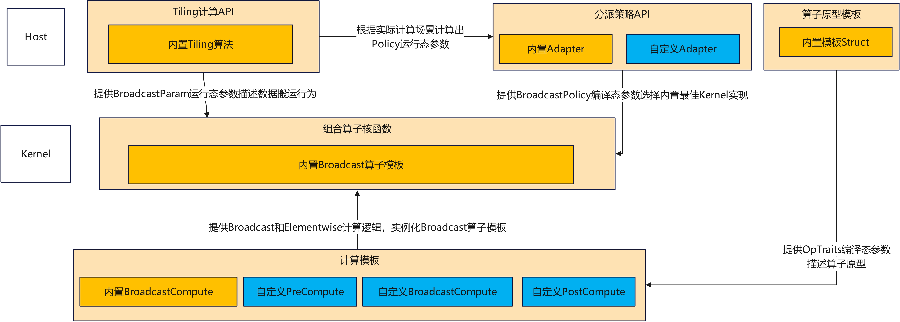

组合算子模板内部根据计算的数据大小，Shape完成了不同计算调度代码的实现，考虑到Broadcast的Tiling复杂度，组合算子的计算调度场景复用Broadcast的调度策略`ATVC::BroadcastPolicy`。在算子调用阶段，分派策略API可根据Tiling API计算出的`ATVC::BroadcastPolicy`转化为编译态参数，结合定制的Elementwise和Broadcast计算模板来实例化`ATVC::Kernel::BroadcastOpTemplate`算子模板类。
根据组合算子在框架内部的交互场景，ATVC提供如下的接口及模板类帮助开发搭建自定义Broadcast与Elementwise组合算子：

需按照以下顺序完成模块之间的组装：

1.自定义前置或后置Elementwise计算模板。

2.自定义Broadcast计算模板/使用框架内置Broadcast计算模板，并组合Elementwise计算模板。

3.将计算模板传入Kernel层模板算子完成核函数功能实现。

4.定义Kernel层算子入口API， 内部实例化计算模板类。

下面将以Add算子（Broadcast + Elementwise, 为区别Add单算字，命名为AddWithBroadcast算子）搭建为样例，按照组装顺序介绍组合算子类的开发流程。

### 3.4.2 组合算子开发步骤
下面是用户利用Components模板实现自定义算子所需要实现的关键步骤，完整样例见[add_with_broadcast](..\examples\add_with_broadcast\add_with_broadcast.cpp) :
```cpp
// AddWithBroadcast算子的描述：两个输入，一个输出，类型均为float
using BroadcastOpTraits = ATVC::OpTraits<ATVC::OpInputs<float, float>, ATVC::OpOutputs<float>, ATVC::OpTemps<float>>;
int32_t main(int32_t argc, char* argv[])
{
    ...
    ATVC::BroadcastParam param;    // Broadcast运行态参数，包含TilingData以及临时空间的相关信息
    ATVC::BroadcastPolicy policy = {-1, -1, -1};  // Broadcast运行态参数，负责映射最适合的Broadcast模板实现
    // Host侧调用Tiling API完成相关运行态参数的运算
    param.nBufferNum = 1;
    if (!ATVC::Host::CalcBroadcastTiling<BroadcastOpTraits>(shapeIn, shapeOut, &policy, &param)) {
        printf("Broadcast tiling error.\n");
        return -1;
    };
    // 调用Adapter调度接口，完成核函数的模板调用
    BroadcastOpAdapter<BroadcastOpTraits>(xDevice, yDevice, zDevice, param, policy);
    ...
}
```

#### 3.4.2.1 实现计算逻辑
组合计算模板复用已有的Elementwise计算模板（详见[3.1.2章节](#312-elementwise算子开发步骤)）和Broadcast计算模板（参见[3.3.2章节](#332-broadcast算子开发步骤)），具体使用方法和约束参考对应章节。

根据实际的算子诉求，构建1个或2个Elementwise计算模板，与1个Broadcast计算模板，作为模板参数传入`ATVC：：BroadcastOpTemplate`中，并在数据计算以及同步阶段被调用。

存在Broadcast的组合计算模板设计多核之间的数据结果同步以及核内分块的对其计算，用户自定义难度较高，因此ATVC框架提供了Broadcast的内置计算模板，并实现了Broadcast在单核内与多核间的计算与同步等函数接口。
##### 3.4.2.1.1 实现Elementwise计算模板
前置或后置Elementwise计算模板除了需要满足基本计算模板的要求外，还需要定义两个额外接口`SetArgs`和`SetParam`，分别用来接受组合算子的向量参数和标量参数。

以`PostCompute`为例， Elementwise计算模板定义如下：

```cpp
template<typename Traits>
struct PostComputeAddOfBroadcast {    
    /* !
    * \brief set scaler param for compute fuction
    * \param [in] args, args are mutable parameters, and are passed transparently from the parameters of
    *                   global kernel functions, which are the parameters after broadcastParam
    */
    template <class... Args>
    __aicore__ inline void SetParam(Args... args) {}

    /* !
    * \brief set tensor param for compute fuction
    * \param [in] args, args are mutable parameters, and are passed transparently from the parameters of
    *                   global kernel functions, which are the parameters before broadcastParam, the num of args is
    *                   decided by Traits
    */
    template <class... Args>
    __aicore__ inline void SetArgs(Args... args) {}

    /* !
    * \brief process function of compute struct
    * \param [in] y, local tensor of y
    * \param [in] z, local tensor of z
    * \param [in] x, local tensor of x,  x is the output of broadcast, must be the last local tensor
    * \param [in] copyOutOffset,  copy out offset for DataCopy
    * \param [in] copyOutParams, copy out params for DataCopy
    */
    template <typename DataType>
    __aicore__ inline void operator()(AscendC::LocalTensor<DataType> y, AscendC::LocalTensor<DataType> z, AscendC::LocalTensor<DataType> x,
        uint32_t copyOutOffset,  AscendC::DataCopyExtParams &copyOutParams) {}
};
```

Elementwise计算模板需要定义三个接口，分别为：

1、`SetParam`函数，入参为可变参数，用户调用Kernel函数传递的scaler参数经过Broadcast模板的分拣，会通过`SetParam`函数传递给每一个计算函数模板。

2、`SetArgs`函数，入参为可变参数，用户调用Kernel函数传递的向量参数经过Broadcast模板的分拣，会根据`OpTraits`计算每个计算模板需要的参数个数，并通过`SetArgs`函数按顺序传递给对应的计算模板。

3、`()`函数，入参为可变参数。用户调用Kernel函数后，Broadcast模板会判断用户是否有定义`PreCompute`或`PostCompute`函数，并用`PreCompute`替换`CopyIn`操作，用`PostCompute`替换`CopyOut`操作。该函数的参数按顺序主要分为3部分：

* 计算模板所需要的LocalTensor，包括输入输出和临时Buffer，内存由Broadcast模板申请，用户可以直接使用，参数的个数模板的所有参数个数-1（剩下一个参数必为Broadcast模板的输入或者输出，不需要额外申请）。
* 单个LocalTensor，复用Broadcast模板的输入或者输出。  
* `CopyIn`或`CopyOut`的参数，包括offset和DataCopyParam，为原来`CopyIn`或`CopyOut`操作时， 调用`AscendC::DataCopy`接口所传递的参数， 用户可以在完成自定义计算后，直接使用该参数做`DataCopy`操作。
  

完整实现见[post_compute_add_of_broadcast.h](../examples/add_with_broadcast/post_compute_add_of_broadcast.h)。


##### 3.4.2.1.2 实现Broadcast计算模板
Broadcast计算模板在组合算子中与Broadcast单算子无任何区别，可直接复用单算子计算模板或使用内置计算模板。

#### 3.4.2.2 实例化模板
在ATVC提供了Broadcast内部实现后，用户需要定义封装核函数接口。核函数内部通过`ATVC::Kernel::BroadcastOpTemplate`完成模板实例化。
Kernel层的自定义API样例如下：

```cpp
// AddWithBroadcast算子的描述：两个输入，一个输出，类型均为float
using BroadcastOpTraits = ATVC::OpTraits<ATVC::OpInputs<float, float>, ATVC::OpOutputs<float>, ATVC::OpTemps<float>>;

/* !
 * \brief z = x + y, the shape of x must be able to be broadcasted to the shape of y
 * \param [in] x, input global memory of x
 * \param [in] y, input global memory of y
 * \param [out] z, output global memory
 * \param [in] broadcastParam, params of broadcast
 */
template <typename Traits, const auto& Policy>
__global__ __aicore__ void AddWithBroadcastCustom(GM_ADDR x,
                                                  GM_ADDR y,
                                                  GM_ADDR z,
                                                  ATVC::BroadcastParam broadcastParam)
{
    KERNEL_TASK_TYPE_DEFAULT(KERNEL_TYPE_AIV_ONLY);

    // 1. get input and output for kernel op from host Traits
    using KernelOpIn = typename Traits::In::types;
    using KernelOpOut = typename Traits::Out::types;
    using KernelOpTemp = typename Traits::Temp::types;

    // 2. define input and output for broadcast
    using BroadcastOpInput = ATVC::OpInputs<typename ATVC::TypeListGet<KernelOpIn, 0>::Type>;
    using BroadcastOpOutput = ATVC::OpOutputs<typename ATVC::TypeListGet<KernelOpTemp, 0>::Type>;
    using BroadcastOpTraits =  ATVC::OpTraits<BroadcastOpInput, BroadcastOpOutput>;

    // 3. define input and output for post compute
    using AddOpInput = ATVC::OpInputs<typename ATVC::TypeListGet<KernelOpTemp, 0>::Type, typename ATVC::TypeListGet<KernelOpIn, 1>::Type>;
    using AddOpOutput = ATVC::OpOutputs<typename ATVC::TypeListGet<KernelOpOut, 0>::Type>;
    using AddOpTraits = ATVC::OpTraits<AddOpInput, AddOpOutput>;
    using PostCompute = PostComputeAddOfBroadcast<AddOpTraits>;

    // 4. call op run
    auto op = ATVC::Kernel::BroadcastOpTemplate<ATVC::BroadcastCompute<BroadcastOpTraits>, Policy, void, PostCompute>();
    ATVC::BroadcastParam *param = &broadcastParam;
    op.Run(x, y, z, param);
}
```

在组合算子中，用户定义的`OpTraits`为组合算子的整体定义，核函数内部根据算子的组合形式，用组合算子的`OpTraits`定义来表达Elementwise和Broadcast算子的`Optraits`定义。例如，Broadcast计算函数的`OpTraits`定义就表示：Broadcast的输入是组合算子的第一个输入，Broadcast算子的输出组合算子的临时资源。

#### 3.4.2.3 Policy与Param的计算与传递
##### 3.4.2.3.1 CalcBroadcastTiling
组合类算子的TilingAPI可以复用`ATVC::Host::CalcBroacastTiling`功能，在此框架上引入`PreCompute`和`PostCompute`对应的`Optraits`。具体信息参考[3.3.2.3.1](#33231-calcbroadcasttiling)章节。在计算基本快所需UB空间时，从`PreCompute`和`PostCompute`的`Optraits`萃取对于UB空间的需求，确保不会出现溢出的情况。简单的，如果用户不用对Tiling做扩展，可以直接用组合算子的`Optraits`来计算Tiling，不需要分别传单算子的`Optraits`。

```cpp
// AddWithBroadcast算子的描述：两个输入，一个输出，类型均为float
using BroadcastOpTraits = ATVC::OpTraits<ATVC::OpInputs<float, float>, ATVC::OpOutputs<float>, ATVC::OpTemps<float>>;
ATVC::Host::CalcBroadcastTiling<BroadcastOpTraits>(shapeIn, shapeOut, &policy, &param);
```

##### 3.4.2.3.2 BroadcastAdapter
`BroadcastAdapter`的介绍可参考章节[3.3.2.3.2](#33232-broadcastopadapter)。

### 3.4.3 BroadcastOpTemplate模板说明
Broadcast与Elementwise组合的算子模板以BroadcastOpTemplate为基础进行扩展，`BroadcastOpTemplate`的介绍可以参考章节[3.3.3](#333-broadcast模板说明)。下面为组合算子场景`ATVC::Kernel::BroadcastOpTemplate`新引入的接口或定义，以及调用计算模板函数的示意代码，完整模板定义请参考[`broadcast_op_template.h`](../include/broadcast/kernel/broadcast_op_template.h)：

```cpp
/*!
 * BroadcastCompute: Used to implement element wise operations between tensors when their shapes are inconsistent.
 * By copying data in a dimension of length 1, the shapes of two tensors are aligned to support element wise
 * addition operations.
*/
template <class BroadcastCompute, const auto& SelectBroadcastPolicy, class PreCompute = void, class PostCompute = void>
class BroadcastOpTemplate {
    static constexpr bool HAS_PRE_COMPUTE = !AscendC::Std::is_same_v<PreCompute, void>;
    static constexpr bool HAS_POST_COMPUTE = !AscendC::Std::is_same_v<PostCompute, void>;
    using PreComputeTraits = AscendC::Std::conditional_t<HAS_PRE_COMPUTE, typename GetFunctionTraits<PreCompute>::ComputeTraits, VoidComputeTraits>;
    using PostComputeTraits = AscendC::Std::conditional_t<HAS_POST_COMPUTE, typename GetFunctionTraits<PostCompute>::ComputeTraits, VoidComputeTraits>;
    using PreInputs = typename PreComputeTraits::In::types;
    using PreOutputs = typename PreComputeTraits::Out::types;
    using PreTemp = typename PreComputeTraits::Temp::types;
    using PostInputs = typename PostComputeTraits::In::types;
    using PostOutputs = typename PostComputeTraits::Out::types;
    using PostTemp = typename PostComputeTraits::Temp::types;
    using DataType = typename BroadcastCompute::DataType;

    /*!
     * \brief Late parameter injection helper. In some fusion scenarios the host side needs to pass additional
     *        runtime parameters (e.g. fused-activation coefficients) after the kernel has already been launched.
     *        SetParam allows such parameters to be forwarded to the pre- and/or post-compute functors.
     * \param[in] param, Pointer to the BroadcastParam structure (tiling, workspace, etc.)
     * \param[in] args, Optional extra parameters consumed by PreCompute / PostCompute
     */
    template <class... Args>
    __aicore__ inline void SetParam(BroadcastParam *param, Args... args) 
    {
        if constexpr (HAS_PRE_COMPUTE) {
            preCompute_.SetParam(args...);
        }
        if constexpr (HAS_POST_COMPUTE) {
            postCompute_.SetParam(args...);
        }
    }

    /*!
     * \brief The external running interface of BroadcastOpTemplate mainly completes resource initialization, 
     *        data migration, calculation scheduling, and data migration operations
     * \param src, GM pointer for input data
     * \param dst, Gm pointer for outputting data
     * \param broadcastParam, Dynamic parameters of broadcast, including tiling data, workspace, etc
     */
    template<typename ...Args>
    __aicore__ inline void Run(Args&&... args)
    {
        // 分拣出tensor参数并按使用个数传递给计算函数
        preCompute_.SetArgs(arg1...);        
        broadcastCompute_.SetArgs(arg2...);
        postCompute_.SetArgs(args3...);

        // 分拣出scaler参数并传给PreCompute和PostCompute
        SetParam(scalerArgs);
    }
};
```

## 3.5 Elementwise + ReduceSum组合算子开发

组合算子模板类的模块之间的交互如下（ATVC框架提供的模板及接口用黄色表示；开发自定义的模块用蓝色表示）：
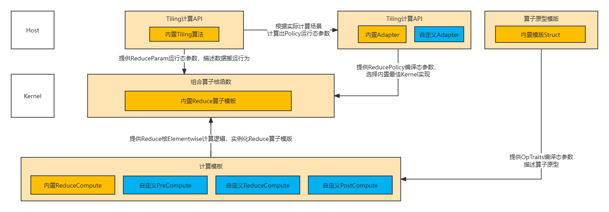

组合算子模板内部根据计算的数据大小，Shape完成了不同计算调度代码的实现，考虑到ReduceSum的Tiling复杂度，组合算子的计算调度场景复用ReduceSum的调度策略`ATVC::ReducePolicy`。在算子调用阶段，分派策略API可根据Tiling API计算出的`ATVC::ReducePolicy`转化为编译态参数，结合定制的Elementwise和ReduceSum计算模板来实例化`ATVC::Kernel::ReduceOpTemplate`算子模板类。

### 3.5.1 组合模板概述
ATVC框架支持ReduceSum与Elementwise组合，组合算子通过扩展ReduceOpTemplate的模板参数对用户提供接口，开发者可以根据算子实际需求来定制组合，框架支持以下组合：Elementwise + ReduceSum、ReduceSum + Elementwise、Elementwise + ReduceSum + Elementwise。下面以ReduceSum与Elementwise组合为例进行详细讲解。
根据组合算子在框架内部的交互场景，ATVC提供如下的接口及模板类帮助开发搭建自定义ReduceSum与Elementwise组合算子：

需按照以下顺序完成模块之间的组装：

1.自定义前置或后置Elementwise计算模板。

2.自定义ReduceSum计算模板/使用框架内置ReduceSum计算模板，并组合Elementwise计算模板。

3.将计算模板传入Kernel层模板算子完成核函数功能实现。

4.定义Kernel层算子入口API，内部实例化计算模板类。

下面将以Add+ReduceSum+Relu算子（命名为ReluWithReduceSum算子）搭建为样例，按照组装顺序介绍组合算子类的开发流程。

### 3.5.2 组合算子开发步骤
下面是用户利用Components模板实现自定义算子所需要实现的关键步骤，完整样例见[relu_with_reduce_sum.cpp](../examples/relu_with_reduce_sum/relu_with_reduce_sum.cpp) :
```cpp
// ReluWithReduceSum算子的描述：一个输入，一个输出，类型均为float
using ReduceOpTraits = ATVC::OpTraits<ATVC::OpInputs<float>, ATVC::OpOutputs<float>, ATVC::OpTemps<float>>;
int32_t main(int32_t argc, char* argv[])
{
    ...
    ATVC::ReduceParam param;    // Reduce运行态参数，包含TilingData以及临时空间的相关信息
    ATVC::ReducePolicy policy = {-1, -1, -1};  // Broadcast运行态参数，负责映射最适合的Broadcast模板实现
    // Host侧调用Tiling API完成相关运行态参数的运算
    param.nBufferNum = 1;
    if (!ATVC::Host::CalcReduceTiling<ReduceOpTraits>(shapeIn, dim, &policy, &param)) {
        printf("Reduce tiling error.\n");
        return -1;
    };
    // 调用Adapter调度接口，完成核函数的模板调用
    ReduceOpAdapter<ReduceOpTraits>(xDevice, yDevice, param, policy, stream);
    ...
}
```
#### 3.5.2.1 实现计算逻辑
组合计算模板复用已有的Elementwise计算模板（详见[3.1.2章节](#312-elementwise算子开发步骤)）和ReduceSum计算模板（参见[3.2.2章节](#322-reduce算子开发步骤)），具体使用方法和约束参考对应章节。

根据实际的算子诉求，构建1个或2个Elementwise计算模板，与1个Reduce计算模板，作为模板参数传入`ATVC::ReduceOpTemplate`中，并在数据计算以及同步阶段被调用。

存在ReduceSum的组合计算模板设计多核之间的数据结果同步以及核内分块的对其计算，用户自定义难度较高，因此ATVC框架提供了ReduceSum的内置计算模板，并实现了ReduceSum在单核内与多核间的计算与同步等函数接口。

##### 3.5.2.1.1 实现Elementwise计算模板
前置或后置Elementwise计算模板除了需要满足基本计算模板的要求外，还需要定义两个额外接口`SetArgs`和`SetScalar`，分别用来接受组合算子的向量参数和标量参数。

以`PostCompute`为例，Elementwise计算模板定义如下：

```cpp
template<typename Traits>
struct PostComputeReluOfReduceSum {
    /* !
     * \brief set scaler param for compute function
     * \param [in] args, args are mutable parameters, and are passed transparently from the parameters of
     *                   global kernel functions, which are the parameters after reduceParam
     */
    template <class... Args>
    __aicore__ inline void SetScalar(Args... args)
    {}

    /* !
     * \brief set tensor param for compute function
     * \param [in] args, args are mutable parameters, and are passed transparently from the parameters of
     *                   global kernel functions, which are the parameters before reduceParam, the num of args is
     *                   decided by Traits
     */
    template <class... Args>
    __aicore__ inline void SetArgs(Args... args)
    {
        InitArgsOutput<0>(args...);
    }

    /* !
     * \brief process function of compute struct
     * \param [in] y, local tensor of y
     * \param [in] reduceOut, local tensor of reduceOut
     * \param [in] copyOutOffset, copy In offset for DataCopy
     * \param [in] copyOutParams, copy out params for DataCopy
     */
    template <typename DataType>
    __aicore__ inline void operator()(AscendC::LocalTensor<DataType> y, AscendC::LocalTensor<DataType> reduceOut,
        uint32_t copyOutOffset, AscendC::DataCopyExtParams &copyOutParams)
    {
        int32_t dataAlignLen = OpsUtils::CeilDiv(copyOutParams.blockLen, BLOCK_LEN) * BLOCK_LEN;
        size_t size =
                copyOutParams.blockCount * (dataAlignLen + copyOutParams.srcStride * BLOCK_LEN) / sizeof(DataType);
        ATVC::SyncDataQueue<AscendC::HardEvent::MTE2_V>();
        Compute<DataType>(y, reduceOut, size);
        ATVC::SyncDataQueue<AscendC::HardEvent::V_MTE3>();
        CopyOut<DataType>(y, copyOutOffset, copyOutParams);
        AscendC::PipeBarrier<PIPE_MTE3>();
    }
};
```

Elementwise计算模板需要定义三个接口， 分别为：

1、`SetScalar`前置或后置Elementwise计算模板除了需要满足基本计算模板的要求外，还需要定义两个额外接口`SetArgs`和`SetParam`，分别用来接受组合算子的向量参数和标量参数。`SetScalar`函数传递给每一个计算函数模板。

2、`SetArgs`函数，入参为可变参数，用户调用Kernel函数传递的向量参数经过Reduce模板的分拣，会根据`OpTraits`计算每个计算模板需要的参数个数，并通过`SetArgs`函数按顺序传递给对应的计算模板。

3、`()`函数，入参为可变参数。用户调用Kernel函数后，ReduceSum模板会判断用户是否有定义`PreCompute`或`PostCompute`函数，并用`PreCompute`替换`CopyIn`操作，用`PostCompute`替换`CopyOut`操作。该函数的参数按顺序主要分为3部分：

* 计算模板所需要的LocalTensor，包括输入输出和临时Buffer，内存由ReduceSum模板申请，用户可以直接使用，参数的个数模板的所有参数个数-1（剩下一个参数必为ReduceSum模板的输入或者输出，不需要额外申请）。
* 单个LocalTensor，复用ReduceSum模板的输入或者输出。  
* `CopyIn`或`CopyOut`的参数，包括`offset`和`DataCopyParam`，为原来`CopyIn`或`CopyOut`操作时， 调用`AscendC::DataCopy`接口所传递的参数， 用户可以在完成自定义计算后，直接使用该参数做`DataCopy`操作。
  

完整实现见[post_compute_relu_with_reduce_sum.h](../examples/relu_with_reduce_sum/post_compute_relu_with_reduce_sum.h)。


##### 3.5.2.1.2 实现ReduceSum计算模板
在组合算子中，ReduceSum计算模板与单个ReduceSum算子的计算模板相同，可以直接复用单算子的计算模板或使用内置的计算模板。

#### 3.5.2.2 实例化模板
在ATVC提供了Reduce内部实现后，用户需要定义封装核函数接口。核函数内部通过`ATVC::Kernel::ReduceOpTemplate`完成模板实例化。
Kernel层的自定义API样例如下：
```cpp

// ReluWithReduceSum算子的描述：一个输入，一个输出，类型均为float
using ReduceOpTraits = ATVC::OpTraits<ATVC::OpInputs<float>, ATVC::OpOutputs<float>, ATVC::OpTemps<float>>;
/* !
 * \brief ReluWithReduceSum(i) = relu(reduce_sum(x+1))
 * \param [in] x, input global memory of x
 * \param [out] y, output global memory
 * \param [in] reduceParam, params of reduce
 */
template <typename Traits, const auto &Policy>
__global__ __aicore__ void ReluWithReduceSum(GM_ADDR x, GM_ADDR y, ATVC::ReduceParam reduceParam)
{
    KERNEL_TASK_TYPE_DEFAULT(KERNEL_TYPE_MIX_AIV_1_0);

    // 1. get input and output for kernel op from host Traits
    using KernelOpInput = typename Traits::In::types;
    using KernelOpOutput = typename Traits::Out::types;
    using KernelOpTemp = typename Traits::Temp::types;

    // 2. define input and output for pre compute
    using PreComputeInput = ATVC::OpInputs<typename ATVC::TypeListGet<KernelOpInput, 0>::Type>;
    using PreComputeOutput = ATVC::OpOutputs<typename ATVC::TypeListGet<KernelOpTemp, 0>::Type>;
    using PreComputeOpTraits = ATVC::OpTraits<PreComputeInput, PreComputeOutput>;
    using PreCompute = PreComputeAddOfReduceSum<PreComputeOpTraits>;

    // 3. define input and output for reduce_sum
    using ReduceSumOpInput = ATVC::OpInputs<typename ATVC::TypeListGet<KernelOpTemp, 0>::Type>;
    using ReduceSumOpOutput = ATVC::OpOutputs<typename ATVC::TypeListGet<KernelOpTemp, 0>::Type>;
    using ReduceSumOpTraits = ATVC::OpTraits<ReduceSumOpInput, ReduceSumOpOutput>;

    // 4. define input and output for post compute
    using PostComputeInput = ATVC::OpInputs<typename ATVC::TypeListGet<KernelOpTemp, 0>::Type>;
    using PostComputeOutput = ATVC::OpOutputs<typename ATVC::TypeListGet<KernelOpOutput, 0>::Type>;
    using PostComputeOpTraits = ATVC::OpTraits<PostComputeInput, PostComputeOutput>;
    using PostCompute = PostComputeReluOfReduceSum<PostComputeOpTraits>;

    // 5. call op run
    auto op = ATVC::Kernel::ReduceOpTemplate<
        ATVC::ReduceSumCompute<ReduceSumOpTraits>, 
        Policy, 
        PreCompute,
        PostCompute>();
    op.Run(x, y, &reduceParam);
}
```
在组合算子中，用户定义的`OpTraits`为组合算子的整体定义，核函数内部根据算子的组合形式，用组合算子的`OpTraits`定义来表达Elementwise和Reduce算子的`Optraits`定义。例如，Reduce计算函数的`OpTraits`定义就表示：Reduce的输入是组合算子的第一个输入，Reduce算子的输出组合算子的临时资源。

#### 3.5.2.3 Policy与Param的计算与传递
##### 3.5.2.3.1 CalcReduceTiling
组合类算子的TilingAPI可以复用`ATVC::Host::CalcReduceTiling`功能，在此框架上引入`PreCompute`和`PostCompute`对应的`Optraits`。具体信息参考[3.2.2.3.1](#32231-calcreducetiling)章节。在计算基本快所需UB空间时，从`PreCompute`和`PostCompute`的`Optraits`萃取对于UB空间的需求，确保不会出现溢出的情况。简单的，如果用户不用对Tiling做扩展，可以直接用组合算子的`Optraits`来计算Tiling，不需要分别传单算子的`Optraits`。

```cpp
// ReluWithReduceSum算子的描述：一个输入，一个输出，类型均为float
using ReduceOpTraits = ATVC::OpTraits<ATVC::OpInputs<float>, ATVC::OpOutputs<float>, ATVC::OpTemps<float>>;
ATVC::Host::CalcReduceTiling<ReduceOpTraits>(shapeIn, dim, &policy, &param);
```

##### 3.5.2.3.2 ReduceOpAdapter
`ReduceOpAdapter`的介绍可参考章节[3.2.2.3.2](#32232-reduceopadapter)。

### 3.5.3 ReduceOpTemplate模板说明
Reduce与Elementwise组合的算子模板以ReduceOpTemplate为基础进行扩展,`ReduceOpTemplate`的介绍可以参考章节[3.2.3](#323-reduce模板说明)。下面为组合算子场景`ATVC::Kernel::ReduceOpTemplate`新引入的接口或定义，以及调用计算模板函数的示意代码，完整模板定义请参考[`reduce_op_template.h`](../include/reduce/kernel/reduce_op_template.h)：

```cpp
 /*!
 * ReduceOpTemplate Generic Reduce operator template.
 * Reduce operators usually refer to operators that perform reduction operations on elements in tensors,
 * such as summation and averaging. They can specify several dimensions for reduction calculations,
 * or reduce all elements to a scalar.
 */
template <class ReduceCompute, const auto& SelectReducePolicy, 
            class PreCompute = void, class PostCompute = void>
class ReduceOpTemplate {
public:
    // for v-v fusion
    constexpr static bool HAS_PRE_COMPUTE = !AscendC::Std::is_same_v<PreCompute, void>;
    constexpr static bool HAS_POST_COMPUTE = !AscendC::Std::is_same_v<PostCompute, void>;
    using PreComputeTraits = AscendC::Std::conditional_t<HAS_PRE_COMPUTE, typename GetFunctionTraits<PreCompute>::ComputeTraits, VoidComputeTraits>;
    using PostComputeTraits = AscendC::Std::conditional_t<HAS_POST_COMPUTE, typename GetFunctionTraits<PostCompute>::ComputeTraits, VoidComputeTraits>;
    using PreInputs = typename PreComputeTraits::In::types;
    using PreOutputs = typename PreComputeTraits::Out::types;
    using PreTemp = typename PreComputeTraits::Temp::types;
    using PostInputs = typename PostComputeTraits::In::types;
    using PostOutputs = typename PostComputeTraits::Out::types;
    using PostTemp = typename PostComputeTraits::Temp::types;
    constexpr static uint32_t ReduceInputCount = 1;
    constexpr static uint32_t ReduceOutputCount = 1;
    constexpr static size_t PreInputCount = ATVC::TypeListSize<PreInputs>::VALUE;
    constexpr static size_t PreOutputCount = ATVC::TypeListSize<PreOutputs>::VALUE;
    constexpr static size_t PreTempCount = ATVC::TypeListSize<PreTemp>::VALUE;
    constexpr static size_t PostInputCount = ATVC::TypeListSize<PostInputs>::VALUE;
    constexpr static size_t PostOutputCount = ATVC::TypeListSize<PostOutputs>::VALUE;
    constexpr static size_t PostTempCount = ATVC::TypeListSize<PostTemp>::VALUE;

    /*!
     * \brief Late parameter injection helper. In some fusion scenarios the host side needs to pass additional
     *        runtime parameters (e.g. fused-activation coefficients) after the kernel has already been launched.
     *        SetScalar allows such parameters to be forwarded to the pre- and/or post-compute functors.
     * \param[in] param, Pointer to the ReduceParam structure (tiling, workspace, etc.)
     * \param[in] args, Optional extra parameters consumed by PreCompute / PostCompute
     */
    template <class T1, class... Args>
    __aicore__ inline void SetScalar(T1 param, Args... args)
    {
        if constexpr (HAS_PRE_COMPUTE) {
            preCompute_.SetScalar(args...);
        }
        if constexpr (HAS_POST_COMPUTE) {
            postCompute_.SetScalar(args...);
        }
    }

    /*!
     * \brief The external running interface of ReduceOpTemplate mainly completes resource initialization, 
     *        data migration, calculation scheduling, and data migration operations
     * \param src, GM pointer for input data
     * \param dst, Gm pointer for outputting data
     * \param reduceParam, Dynamic parameters of reduce, including tiling data, workspace, etc
     */
    template<typename ...Args>
    __aicore__ inline void Run(Args&&... args)
    {
        // 分拣出tensor参数并按使用个数传递给计算函数
        preCompute_.SetArgs(arg1...);        
        reduceCompute_.SetArgs(arg2...);
        postCompute_.SetArgs(args3...);

        // 分拣出scaler参数并传给PreCompute和PostCompute
        SetScalar(scalerArgs);
    }
};
```

## 3.6 Pool算子开发
### 3.6.1 Pool模板概述
ATVC框架提供的Pool算子模块之间的交互与ElementWise模板类似，自定义Pool算子需按照以下顺序完成模块之间的组装：
1. 定义计算模板。
2. 将计算模板类传入Kernel层算子模板完成核函数功能实现。
3. 定义Kernel层算子入口API，内部实例化计算模板类。


### 3.6.2 Pool算子开发步骤
下面将以Edge算子的实现为样例，按照组成Kernel的顺序介绍Pool算子开发的关键步骤进行介绍。通过ATVC框架实现的Edge完整算子样例代码见[样例代码](../examples/edge/edge.cpp)：
```cpp
// 描述算子的输入输出以及临时计算资源
using PoolOpTraits = ATVC::OpTraits<ATVC::OpInputs<float>, ATVC::OpOutputs<float>, ATVC::OpTemps<int32_t>>;
// 传入编译态参数ATVC::OpTraits
template <typename Traits>
struct Edge2C3ComputeFunc {
    static constexpr ATVC::Layout2Dim TILE_LAYOUT{16, 16};  // 基本块宽高 宽需要32B对齐 未裁剪前的
    static constexpr ATVC::PoolTilePadding TILE_PADDING{
        8, 8, 1, 1};  // tile块上下左右padding的设置left/right需要32B对齐 未裁剪前基础值
    /*
    函数说明： c = a + b
    参数说明：
        a                   : 参与运算的输入
        c                   : 参与运算的输出
    */
    template <typename T, typename U>
    // 重载operator，提供给算子模板类调用
    __aicore__ inline void operator()(
        AscendC::LocalTensor<T> a, AscendC::LocalTensor<T> c, AscendC::LocalTensor<U> temp)
    {
        uint32_t calcSize = c.GetSize();
        uint32_t sizeT = sizeof(T);
        static constexpr uint32_t TENSOR_WIDTH = TILE_PADDING.left + TILE_LAYOUT.width + TILE_PADDING.right;
        // 0 1 2
        // 3 4 5
        // 6 7 8
        // 计算: x[1,4,7]: x[2,5,8] - x[0,3,6]
        AscendC::CreateVecIndex<U>(temp, (int32_t)2, calcSize);
        AscendC::PipeBarrier<PIPE_V>();
        AscendC::Muls<U>(temp, temp, sizeT, calcSize);
        AscendC::PipeBarrier<PIPE_V>();
        AscendC::LocalTensor<uint32_t> tempRef = temp.template ReinterpretCast<uint32_t>();
        AscendC::Gather(c, a, tempRef, 0, calcSize - 2);
        AscendC::PipeBarrier<PIPE_V>();
        AscendC::Sub(a, c, a, calcSize);
        AscendC::Adds<U>(temp, temp, (sizeT * -3), calcSize);
        AscendC::PipeBarrier<PIPE_V>();
        AscendC::Relu(temp, temp, 1);
        AscendC::PipeBarrier<PIPE_V>();
        AscendC::Gather(c, a, tempRef, 0, calcSize - 2);
        // 计算: x[4]: min(abs((x[1] + x[4] + x[7] / 3), 255)
        AscendC::Add(a[TENSOR_WIDTH], c, c[TENSOR_WIDTH * 2], calcSize - TENSOR_WIDTH * 2);
        AscendC::PipeBarrier<PIPE_V>();
        AscendC::Add(c, a, c, calcSize);
        AscendC::PipeBarrier<PIPE_V>();
        AscendC::Muls(c, c, 1 / 3.0f, calcSize);
        AscendC::PipeBarrier<PIPE_V>();
        AscendC::Abs(c, c, calcSize);
        AscendC::PipeBarrier<PIPE_V>();
        AscendC::Mins(c, c, 255.0f, calcSize);
    }
};

static constexpr ATVC::Layout2Dim totalLayout{1023, 2517};  // 原图宽高

...

template <class Traits, const auto &totalLayout>
__global__ __aicore__ void EdgeCustom(GM_ADDR a, GM_ADDR c, ATVC::PoolParam param)
{
    KERNEL_TASK_TYPE_DEFAULT(KERNEL_TYPE_AIV_ONLY);

    // 将Edge2C3ComputeFunc仿函数作为模板参数传入，实例化PoolOpTemplate模板类
    auto op = ATVC::Kernel::PoolOpTemplate<Edge2C3ComputeFunc<Traits>, totalLayout>();
    op.Run(a, c, &param);  // 按照输入、输出、param的顺序传入Run函数，实现GM->GM的数据计算
}

...

// 调用自定义的Kernel API, <<<>>>的BlockNum参数可通过param的TilingData获取
EdgeCustom<PoolOpTraits, totalLayout><<<blockNum, nullptr, stream>>>(xDevice, zDevice, param);

...

```
#### 3.6.2.1 实现计算逻辑
计算模板是用户必须在Pool算子实现过程中完成的一类特殊模板类的定义。模板类无需关注数据如何从GM搬运到UB，只需重载`operator()`的公有接口，并在该仿函数内部实现`AscendC::LocalTensor`之间的计算逻辑。在Kernel层的组装阶段，计算模板将作为模板参数传入`ATVC::Kernel::PoolOpTemplate`，并在数据计算阶段被调用。下方为计算模板实现计算逻辑的代码样例：
```cpp
#include "atvc.h" // 包含所有模板及API的总入口头文件

template <typename Traits>
struct Edge2C3ComputeFunc {
    static constexpr ATVC::Layout2Dim TILE_LAYOUT{16, 16};  // 基本块宽高 宽需要32B对齐 未裁剪前的
    static constexpr ATVC::PoolTilePadding TILE_PADDING{
        8, 8, 1, 1};  // tile块上下左右padding的设置left/right需要32B对齐 未裁剪前基础值
    /*
    函数说明： c = a + b
    参数说明：
        a                   : 参与运算的输入
        c                   : 参与运算的输出
    */
    template <typename T, typename U>
    // 重载operator，提供给算子模板类调用
    __aicore__ inline void operator()(
        AscendC::LocalTensor<T> a, AscendC::LocalTensor<T> c, AscendC::LocalTensor<U> temp)
    {
        uint32_t calcSize = c.GetSize();
        uint32_t sizeT = sizeof(T);
        static constexpr uint32_t TENSOR_WIDTH = TILE_PADDING.left + TILE_LAYOUT.width + TILE_PADDING.right;
        // 0 1 2
        // 3 4 5
        // 6 7 8
        // 计算: x[1,4,7]: x[2,5,8] - x[0,3,6]
        AscendC::CreateVecIndex<U>(temp, (int32_t)2, calcSize);
        AscendC::PipeBarrier<PIPE_V>();
        AscendC::Muls<U>(temp, temp, sizeT, calcSize);
        AscendC::PipeBarrier<PIPE_V>();
        AscendC::LocalTensor<uint32_t> tempRef = temp.template ReinterpretCast<uint32_t>();
        AscendC::Gather(c, a, tempRef, 0, calcSize - 2);
        AscendC::PipeBarrier<PIPE_V>();
        AscendC::Sub(a, c, a, calcSize);
        AscendC::Adds<U>(temp, temp, (sizeT * -3), calcSize);
        AscendC::PipeBarrier<PIPE_V>();
        AscendC::Relu(temp, temp, 1);
        AscendC::PipeBarrier<PIPE_V>();
        AscendC::Gather(c, a, tempRef, 0, calcSize - 2);
        // 计算: x[4]: min(abs((x[1] + x[4] + x[7] / 3), 255)
        AscendC::Add(a[TENSOR_WIDTH], c, c[TENSOR_WIDTH * 2], calcSize - TENSOR_WIDTH * 2);
        AscendC::PipeBarrier<PIPE_V>();
        AscendC::Add(c, a, c, calcSize);
        AscendC::PipeBarrier<PIPE_V>();
        AscendC::Muls(c, c, 1 / 3.0f, calcSize);
        AscendC::PipeBarrier<PIPE_V>();
        AscendC::Abs(c, c, calcSize);
        AscendC::PipeBarrier<PIPE_V>();
        AscendC::Mins(c, c, 255.0f, calcSize);
    }
};
```
计算模板类将在数据计算阶段被算子模板调用，因此计算模板类定义必须遵从以下约束：
1. 该模板类在实例化时固定传入`ATVC::OpTraits`类型的结构体作为模板参数，如 `ATVC::OpTraits<ATVC::OpInputs<float, float>,ATVC::OpOutputs<float>, ATVC::OpTemps<float, float>>`。
2. 开发必须完成公有仿函数`__aicore__ inline void operator()`的重载。`ATVC::Kernel::EleWiseOpTemplate`将在计算阶段调用仿函数完成计算。
3. 开发定义的`operator()`仿函数的输入参数类型支持`AscendC::LocalTensor<T>`以及C++其他基础数据类型。形式参数需按照`ATVC::OpInputs<>`,`ATVC::OpOutputs<>`, `ATVC::OpTemps<>`声明的顺序填入，其他标量参数放在最后，根据用户计算场景按需传入。
4. `struct Edge2C3ComputeFunc`计算函数类中必须设置`TILE_LAYOUT`和`TILE_PADDING`, 用来表示计算时的基本块元素大小和计算时需要的上下左右外扩元素个数。
- `TILE_LAYOUT`和`TILE_PADDING`设置方式如下所示：
    ```cpp
        // 计算基本块宽高 宽需要32B对齐
        static constexpr ATVC::Layout2Dim TILE_LAYOUT{16, 16};
        // tile块上下左右padding的设置left/right需要32B对齐 未裁剪前基础值
        static constexpr ATVC::PoolTilePadding TILE_PADDING{ 8, 8, 1, 1};
    ```
- 数据类型`ATVC::Layout2Dim`和`PoolTilePadding`定义如下：
    ```cpp
    struct Layout2Dim {
        uint32_t width;
        uint32_t height;
    };
    struct PoolTilePadding {
        uint32_t left = 0;
        uint32_t right = 0;
        uint32_t up = 0;
        uint32_t down = 0;
    };
    ```


#### 3.6.2.2 实例化模板

在Pool算子开发流程中，用户需要自行定义核函数接口。核函数内部通过`ATVC::Kernel::PoolOpTemplate`完成模板实例化。

Kernel层的自定义核函数代码样例如下：
```cpp
template <class Traits, const auto &totalLayout>
__global__ __aicore__ void EdgeCustom(GM_ADDR a, GM_ADDR c, ATVC::PoolParam param)
{
    KERNEL_TASK_TYPE_DEFAULT(KERNEL_TYPE_AIV_ONLY);

    // 将Edge2C3ComputeFunc仿函数作为模板参数传入，实例化PoolOpTemplate模板类
    auto op = ATVC::Kernel::PoolOpTemplate<Edge2C3ComputeFunc<Traits>, totalLayout>();
    op.Run(a, c, &param);  // 按照输入、输出、param的顺序传入Run函数，实现GM->GM的数据计算
}
```
<br>

利用ATVC框架开发Pool算子的过程中，Kernel层的核函数定义必须遵从以下约束：

1. 核函数必须预留一个GM_ADDR类型的形参用于传入`ATVC::PoolParam`运行态参数。
2. 核函数内部必须加入`KERNEL_TASK_TYPE_DEFAULT(KERNEL_TYPE_AIV_ONLY);`这段代码标注算子执行时只启动Vector核。
3. 核函数必须初始化`ATVC::Kernel::PoolOpTemplate`变量并调用它的`Run(Args&&... args)`接口来实现数据的调度运算。

#### 3.6.2.3 Policy与Param的计算与传递
ATVC的Host层提供了Pool算子的通用Tiling算法API `ATVC::Host::CalcPoolTiling`，它根据算子计算原型`ATVC::OpTraits`以及数据大小计算出包含`ATVC::PoolTilingData`的运行态参数`ATVC::PoolParam`。`ATVC::PoolParam`在运行时将参与模板算子数据搬运从而实现较优计算。<br>`ATVC::PoolTilingData`和`ATVC::PoolParam`的数据结构定义如下：
```cpp
namespace ATVC{
struct PoolTilingData {
    uint32_t tiledCntH;     // Height of per tile block
    uint32_t tiledCntW;     // Width of per tile block
    uint32_t tailBlockCnt;  // The number of cores that need to execute an additional loop
    uint32_t tailElemCnt;   // The number of tail block elements
    uint32_t numPerBlock;   // The number of basic blocks to be calculated for each core
    uint32_t tiledCnt;      // The number of basic block elements
    uint32_t blockNum;      // Execute core number
    uint32_t height;        // Original height
    uint32_t width;         // Original 原始width
};

struct PoolParam {
    PoolTilingData tilingData;  // Related parameters affecting data handling
    uint32_t totalCnt = 0;      // The number of elements in a single Tensor
    uint32_t nBufferNum = 2;    // The number of Tensors in each queue
};
}
```

通过调用`ATVC::Host::CalcPoolTiling`接口计算得到`ATVC::PoolParam param`:
```cpp
    ATVC::PoolParam param;
    if (!ATVC::Host::CalcPoolTiling<PoolOpTraits>(totalLayout, Edge2C3ComputeFunc<PoolOpTraits>::TILE_LAYOUT, param)) {
        (void)printf("[ERROR]: Calculate Element wise tiling Failed.\n");
        return -1;
    };
```

### 3.6.3 Pool模板说明
`ATVC::Kernel::PoolOpTemplate`为ATVC框架提供的内置Pool基本算子类，它实现了一套算子数据的搬运搬出、资源分配和释放的算子流程。它需要计算模板类作为模板参数传入来完成实例化。核函数通过调用它完成整套计算逻辑：1. 资源初始化; 2.将数据从GM搬运至UB; 3.按`OpTraits`的输入、输出、临时资源描述、其他标量的顺序传入计算模板类的仿函数完成数据的基块计算; 4.将结果从UB搬出至GM。

下方为`ATVC::Kernel::PoolOpTemplate`模板类的外部接口介绍，完整模板类定义请参考[`pool_template头文件`](../include/pool/kernel/pool_op_template.h)。
```cpp
template <class PoolCompute, const ATVC::Layout2Dim &totalLayout>
class PoolOpTemplate {
    using PoolOpTraits = typename GetFunctionTraits<PoolCompute>::ComputeTraits;

public:
    __aicore__ inline PoolOpTemplate();
    template <typename... Args>
    __aicore__ inline void Run(Args &&...args);
};
```
在`PoolOpTemplate`类的Run接口中，实现了按照切分块进行轮询拷贝数据到UB上进行计算，实际拷贝的数据是根据`PoolCompute::TILE_PADDING`对切分块进行外扩的，计算完成后，将非外扩的实际计算结果数据拷贝到输出的GM内存上。


### 3.6.4 切分策略算法说明
这里简单介绍下`ATVC::Host::CalcPoolTiling`函数内部计算Tiling参数的步骤，详细代码请参考[Pool Tiling 算法](../include/pool/host/pool_host.h)。 

- 计算基本块：根据输入的总的layout和切分的tile块layout信息，计算全部切分tile块的个数。
- 计算核数：保证每个核至少计算一个tile基本块，并根据硬件核数上限确定实际启动的核数。
- 按照均匀分配的策略，计算每个核需要处理的tile块，计算需要多处理一次的核数，计算每个核的平均计算元素量等信息。


# 4 ATVC的调试调优功能
为了用户在使用ATVC进行算子开发时能快速进行精度调试和性能调优，ATVC支持多种调试调优能力。
## 4.1 OpTraits校验接口
用户可通过`DebugCheck()`接口校验不同模板的OpTraits功能, 接口在Host侧调用，无需额外的开关限制,接口定义如下：
```cpp
namespace ATVC {
namespace Host {
template <typename OpTraits, ATVC::TemplateType templateType>
bool DebugCheck()
}
}
```

其中，模板参数`OpTraits`是用户定义的待校验的输入输出描述信息, 模板参数`templateType`是校验规则分类的标识， 定义如下:
```cpp
enum class TemplateType {
    ELE_WISE,   // ElementWise模板的校验类型
    REDUCE,     // Reduce模板的校验类型
    BROADCAST,  // Broadcast模板的校验类型
};
```
DebugCheck主要校验项如下:
|      模板类型     |                   OpTraits校验项                    |
|   -----------     |                  ---------------                    |
|      ELE_WISE     | 输入输出非空                                        |
|       REDUCE      | 输入输出个数均为1, 输入输出数据类型相同              |
|     BROADCAST     | 输入输出个数均为1, 输入输出数据类型相同              |

接口使用示例:
```cpp
using AddOpTraits = ATVC::OpTraits<ATVC::OpInputs<float, float>, ATVC::OpOutputs<float>>;

ATVC::Host::DebugCheck<AddOpTraits, ATVC::TemplateType::ELE_WISE>();
```
完整的`DebugCheck`调用接口样例可参考tanh_grad算子[样例代码](../examples/tanh_grad/tanh_grad.cpp)。
## 4.2 使用调试调优模式运行算子
样例执行脚本run_examples.sh支持可选入参`--run-mode`进行不同调试调优运行模式的选择。
当前支持`debug_print`和`profiling`两种模式。
- `--run-mode=debug_print`：DFX信息打印模式，打开kernel侧的模板内置关键节点的信息打印和异常退出时的打印功能。
- `--run-mode=profiling`：Profiling性能采集模式，运行时打开profiling性能数据采集功能。
- 未设置`--run-mode`：默认模式，正常上板，无kernel侧的dfx信息打印， 未开启profiling性能采集功能。
### 4.2.1 DFX信息打印模式
通过运行run_examples.sh脚本时加上可选参数`--run-mode=debug_print`打开本功能。
DFX信息打印格式按照 [日志级别(`ERROR`/`INFO`)]:[`ATVC`][`Module`] (可选：[`CopyIn`/`CopyOut`等]) 的标准进行打印。
- 日志级别： ERROR是异常打印信息，INFO是模板内部重要信息打印。
- `ATVC`： 标识是ATVC模板库内置的DFX信息打印。
- `Module`: 标识是哪个模块的信息打印，例如：`EleWise`、 `Reduce`、`Broadcast`、`Common`等模块。
- 可选子模块： 用于部分`Module`涉及多个子模块，可选择增加子模块信息，细化DFX信息。
模板内部提供的DFX信息打印接口定义及使用样例如下所示， 对于普通算子开发用户，无需关注该接口，只有需要修改或者扩展开发模板功能的场景，可使用该接口。
```cpp
//接口定义
namespace ATVC {
namespace Kernel {
template <class... Args>
__aicore__ inline void DebugPrintf(__gm__ const char* fmt, Args&&... args);
}
}
// 调用示例
ATVC::Kernel::DebugPrintf("[ERROR]: [ATVC][EleWise] Input Count can not be 0!\n");
ATVC::Kernel::DebugPrintf("[INFO]: [ATVC][EleWise][CopyIn] Offset is %u, copy count is %u.\n", curCoreStartCnt_ + offsetCnt_, calcCnt_);
```

### 4.2.2 开启Profiling性能调优功能
通过运行run_examples.sh脚本时加上可选参数`--run-mode=profiling`打开本功能。
为了增加Profiling采集性能数据的稳定性，建议用户在开启profiling时，运行时重复多次调用kernel，可实现一次性采集多次上板的性能数据，消除抖动。
```cpp
TanhGrad<AddOpTraits><<<blockNum, nullptr, stream>>>(dyDevice, yDevice, zDevice, paramDevice);
#if ATVC_DEBUG_MODE == 2                // ATVC_DEBUG_MODE == 2: open profiling
    for (int32_t i = 0; i < 19; i++) {  // 19: run kernel 1 + 19 times for profiling
        TanhGrad<AddOpTraits><<<blockNum, nullptr, stream>>>(dyDevice, yDevice, zDevice, paramDevice);
    }
#endif
```
其中`ATVC_DEBUG_MODE`是`run-mode`在不同的模式下的内部宏定义的映射。`ATVC_DEBUG_MODE == 2`是`--run-mode=profiling`的内部映射，用户无需关注。

## 4.3 Tiling超参调优
### 4.3.1 Elementwise模板算子Tiling超参调优
#### 4.3.1.1  Elementwise模板通用Tiling算法
- 计算`blockNum`：计算`blockNum` = 总的元素量(`totalCnt`) / 单核数据量基线(`singleCoreBaseLine`), `blockNum`最小值为1， 最大值为平台提供的最大`vectorCore`值。
- 计算达到UB上限的单核单输入元素个数值`ubLimitCnt`：UB上限内存大小 / 所有输入输出及temp单个元素的内存之和。
- 计算`tiledCnt`：
    - 计算每个核需要处理的数据元素量`avgElePerBlock = totalCnt / blockNum`。
    - 根据`avgElePerBlock`所处的`splitDataShape`数据段，按照切分系数去切分基本块： `tiledCnt = dataSplitFactor / dataSplitFactor`。
    - `tiledCnt`调整： 不超上限`ubLimitCnt`， 不小于下限32，且最后的`tiledCnt`要做32元素对齐。
#### 4.3.1.2 Elementwise TilingData定义
Elementwise模板通用Tiling切分的数据结构为EleWiseTilingData，描述了核间切分和单核内切分的策略，其定义如下：
```cpp
namespace ATVC {
struct EleWiseTilingData {
    uint32_t tailBlockCnt;  // The number of cores that need to execute an additional loop
    uint32_t tailElemCnt;   // The number of tail block elements
    uint32_t numPerBlock;   // The number of basic blocks to be calculated for each core
    uint32_t tiledCnt;      // The number of basic block elements
    uint32_t blockNum;      // Execute audit
};
}
```

#### 4.3.1.3 Elementwise Tiling超参调优
当前提供的Elementwise模板内置通用Tiling可调超参如下所示：
| Tiling超参名     | 数据类型  |  参数说明   |  调节范围 |  默认值 |
| ----------- | -------------- | ----------- | ----------- |---|
| singleCoreBaseLine | uint32_t | 单核数据量基线 |  [256, 128 * 1024] | 512|
| ubSizeLimitThreshold | float  | UB内存使用上限，决定了basicBlock最大值 | [0.5, 0.96] | 0.95 |
| nBufferNum | uint32_t  | 用于并行流水的buffer数量 | [1, 2] | 2 |
| splitDataShape | uint32_t[3]| 单核内数据量的3个分段节点，表示数据量分为4段| {node_0, node_1, node_2} | {1024, 32 * 1024, 64 * 1024}|
| dataSplitFactor | uint32_t[4]| 单核内4个数据段的切分系数, 决定不同数据段的切分基本块的大小| {factor_0, factor_1, factor_2, factor_3} 均需在范围[1, 32]| {4, 4, 8, 6}|
| rsvLiveCnt | uint32_t| 预留的空间大小为rsvLiveCnt * (inputBuffer + outputBuffer)|[0, 1]| 0|

对应的超参`EleWiseTilingHyperParam`数据结构定义如下：
```cpp
namespace ATVC {
namespace Host {
struct EleWiseTilingHyperParam {
    uint32_t singleCoreBaseLine = 512;   // data volume baseline for a core, the valid setting range: [256, 128 * 1024]
    float ubSizeLimitThreshold = 0.95f;  // UB memory usage upper limit，determines the maximum value of basicBlock
    uint32_t nBufferNum = 2;             // The number of parallelism buffer, the valid setting range: [1, 2]
    uint32_t splitDataShape[MAX_SHAPE_NODE] = {1024, 32 * 1024, 64 * 1024};  // Segmentation nodes for shape
    uint32_t dataSplitFactor[MAX_SHAPE_NODE + 1] = {4, 4, 8, 6};  // The split coefficient for each segmentation nodes
    uint32_t rsvLiveCnt = 0;  // Additional surviving nodes, means to reserve a portion of UB space.
};
}
}
```
计算接口`CalcEleWiseTiling()`定义如下所示：
```cpp
namespace ATVC {
namespace Host {
template <class OpTraits>
bool CalcEleWiseTiling(int32_t totalCnt, ATVC::EleWiseParam &param,
        EleWiseTilingHyperParam hyperParam = EleWiseTilingHyperParam());
}
}
```
其中，可选参数`hyperParam`在未传入用户自定义超参时，使用`EleWiseTilingHyperParam`的默认值。
若用户需要修改某个超参，调用示例如下所示：
```cpp
    // Add算子中有两个输入，一个输出。类型均为float
    using AddOpTraits = ATVC::OpTraits<ATVC::OpInputs<float, float>, ATVC::OpOutputs<float>>;
    // totalCnt描述EleWise单输入的元素个数
    int32_t eleNum = 8 * 1024;
    // 声明运行态参数param
    ATVC::EleWiseParam param;
    ATVC::Host::EleWiseTilingHyperParam hyperParam;
    hyperParam.singleCoreBaseLine = 1024;
    if (!ATVC::Host::CalcEleWiseTiling<AddOpTraits>(eleNum, param, hyperParam=hyperParam)) {
        printf("[ERROR]: Calculate eleWise tiling failed.\n");
        return -1;
    };
```
### 4.3.2 Reduce模板算子Tiling超参调优
#### 4.3.2.1 Reduce Tiling通用算法
Reduce Tiling计算流程较为复杂，简化后的主要流程如下：
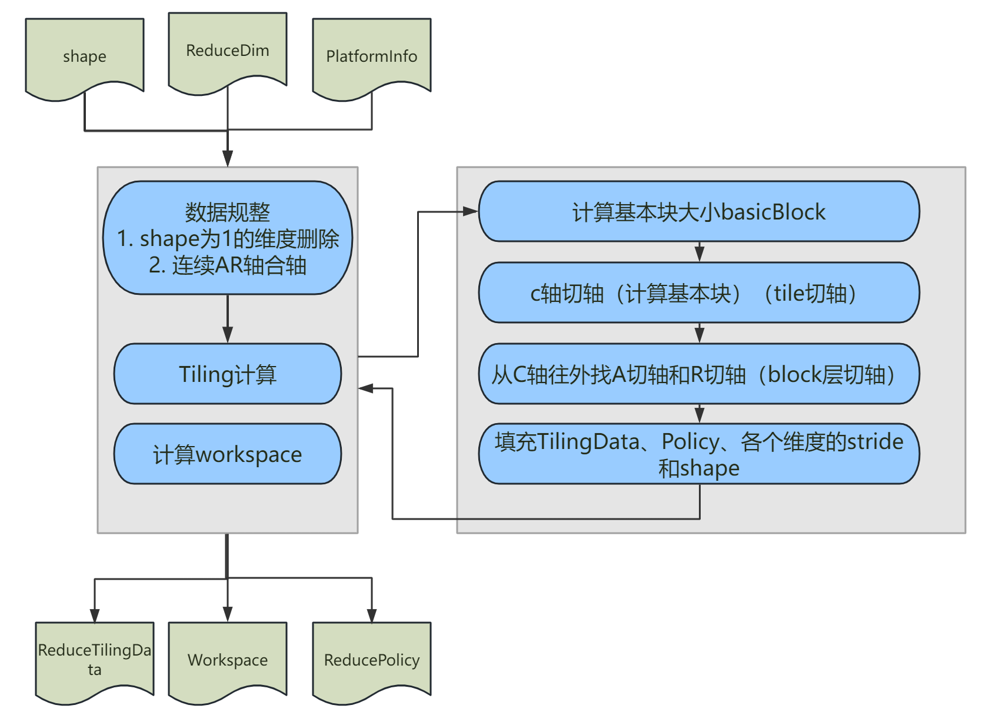<br>
#### 4.3.2.2 Reduce TilingData定义
ATVC host 和kernel侧都会使用到的`ReduceTilingData`是Reduce的核间AR轴切分、单核内AR轴切分的策略，其定义如下：
```cpp
namespace ATVC {
struct ReduceTilingData {
    uint64_t factorACntPerCore; // The actual dimensions of non Reduce axes that do not participate
                                // in computation on each core
    uint64_t factorATotalCnt;   // The total dimension of non Reduce axes that do not participate in the calculation
    uint64_t ubFactorA;         // The amount of data on non Reduce axes within a single UB
    uint64_t factorRCntPerCore; // The actual dimension of the Reduce axis involved in computation on each core
    uint64_t factorRTotalCnt;   // The total dimension of the Reduce axis involved in the calculation
    uint64_t ubFactorR;         // Reduce axis dimension involved in calculation within a single UB
    uint64_t groupR;            // The tangent axis is the R axis, and the relative data amount of R
                                // outside the tangent point on this axis
    uint64_t outSize;           // The total amount of AR data outside the cutting axis
    uint64_t basicBlock;        // The basic data block size
    int32_t coreNum;            // The number of running cores
    float meanVar;              // Reserved
    uint64_t shape[MAX_DIM];        //  Shape info
    uint64_t stride[MAX_DIM];       //  Input data transfer step size
    uint64_t dstStride[MAX_DIM];    // Output data transfer step size
};
}
```
#### 4.3.2.3 Reduce 超参调优
可调参数如下所示：
| Tiling超参名     | 数据类型  |  参数说明   |  调节范围 |  默认值 |
| ----------- | -------------- | ----------- | ----------- |---|
| basicBlock | uint32_t | Reduce 基本块内存大小 | 不能超过UB内存的1/3， 192K内存 建议在48K-54K之间设置 | 48 * 1024|
| maxInnerA | uint32_t |AR切轴内A轴的最大数据量 | [128, 256] | 128 |
| balanceThreshHold | double| 多核均衡的阈值水平, 阈值越高，切分后每个核处理的数据量越均衡 | [0.8, 0.95]| 0.85 |

对应的超参`ReduceTilingHyperParam`结构定义如下：
```cpp
namespace ATVC {
namespace Host {
struct ReduceTilingHyperParam {
    // Set the basic block memory size for Reduce, generally not exceeding 1/3 of the memory. It is recommended to set
    // it between [48k-54k]
    uint32_t basicBlock = 48 * 1024;
    uint32_t maxInnerA = 128;         // [128, 256]
    double balanceThreshHold = 0.85;  // Threshold level for multi-core equilibrium [0.8-0.95]
};
}
}
```
Reduce Tiling的计算接口`CalcReduceTiling()`定义如下：
```cpp
namespace ATVC {
namespace Host {
template<class OpTraits>
bool CalcReduceTiling(std::vector<int64_t> inputShape,
                      std::vector<int64_t> reduceDim,
                      ReducePolicy* policy,
                      ReduceParam* param,
                      ReduceTilingHyperParam hyperParam = ReduceTilingHyperParam());
}
}
```
其中，可选参数`hyperParam`在未传入用户自定义超参时，使用`ReduceTilingHyperParam`的默认值,若用户需要修改某个超参，可自定义`ReduceTilingHyperParam`后传入。
